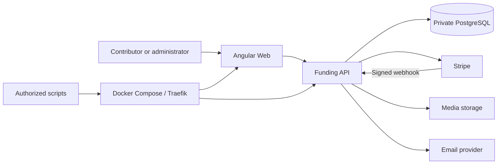

# OpenG7 Funding Platform Architecture

[Français](ARCHITECTURE.md) · English translation. Read one language only.
Update both versions together; neither language may acquire separate requirements.

This document describes durable boundaries and their rationale. Execution rules
belong in [AGENTS.md](../AGENTS.md); current contracts and evidence belong in the
[documentation index](README.md) and [platform status](platform-status.md).
Target boundaries do not establish implementation or production activation.

## Product and authorities

The fund covers personal contributions, sponsorships, Checkout, transparency,
expenses, refunds/credit notes, media, publication, audit and recovery.
External imports such as La Ruche remain a
[design proposal](external-contributions-laruche-cadrage.md). Receipts and copy
must not suggest charitable status or tax deductibility without an explicit legal change.

| Concern                                                                                         | Authority                                                  |
| ----------------------------------------------------------------------------------------------- | ---------------------------------------------------------- |
| Payment, charge, fee, net, dispute, processor refund                                            | Stripe                                                     |
| Contribution, consent, review, visibility, publication, expenses, documents, attribution, audit | PostgreSQL                                                 |
| Accounting projection                                                                           | PostgreSQL journal reconciled against Stripe facts         |
| Presentation                                                                                    | Web, without financial authority or security authorization |
| Exact topology, commands and contracts                                                          | Compose, manifests, implementation and scripts             |
| Secrets                                                                                         | Runtime environment and protected storage, outside Git     |

Store Stripe references and necessary metadata, never card data. Email, URLs and
UI state are not financial facts.

## Components and dependencies

| Path                           | Responsibility                                                                               |
| ------------------------------ | -------------------------------------------------------------------------------------------- |
| `apps/funding-web`             | Public/admin pages, contributions and follow-up, accessibility, i18n, presentation state     |
| `apps/funding-api`             | Authorization, Checkout/webhooks, domain operations, projections, files, queues and adapters |
| `packages/funding-core`        | Framework-independent rules and deterministic calculations                                   |
| `packages/funding-models`      | Immutable types and neutral contracts                                                        |
| `packages/funding-ui`          | Actually shared primitives and tokens                                                        |
| `packages/funding-i18n`        | Translation keys and locale metadata                                                         |
| `scripts`, `traefik`           | Operations, routing, health, backup and recovery                                             |
| `apps/production-launch-agent` | Optional VPS tool subject to the same authorizations                                         |

Web calls the API; only the API combines Stripe facts with business state.
Packages cannot import `apps/**`, read `.env` or form dependency cycles.
Extract a distributed dependency or accounting package only with a second actual
consumer and a stable contract.

Front end: pages → orchestration/templates → domain UI → neutral components → tokens.
Atomic Design describes atoms, molecules, organisms, templates and pages; domain
scope determines placement. Primitives do not depend on routing/HTTP, stores or
sessions. Signals own local state; NgRx is reserved for durable shared state.
Refresh financial state after mutations; never use optimistic financial success.
The Web provides SSR, complete UI states, accessible navigation and translations.

API: HTTP/jobs/webhooks → use cases → domain → ports → adapters.
Domains include payment, contribution, sponsorship, accounting, expense, refund/
credit note, transparency, reconciliation, media and audit. Domain logic does not
depend on Stripe shapes, SQL clients, HTTP servers or storage SDKs. Modular
organization is a direction, not a requirement to relocate existing files.
[Scoped instructions](../AGENTS.md#lectures-selon-la-tâche) provide implementation rules.

## Financial consistency

1. The browser selects type, amount and consent; the API validates and creates Checkout.
2. Stripe redirects the browser: informational return, still requiring server confirmation.
3. The API verifies the signed raw webhook, deduplicates the event and persists
   related writes atomically, retaining processing state, correlation and audit.
4. A transaction can precede its fees: `charge.updated` enriches the same fact from
   Balance Transaction without duplicating the contribution.

Use integer minor units, explicit currency and UTC dates. Confirmed financial
history is append-only; corrections use compensation, refunds or credit notes.
Issued documents are stable snapshots. Stripe confirms the external refund;
the credit note explains the internal correction and does not replace that refund.

Repeatable operations have idempotency keys and recovery state. Reusing a key
with incompatible content causes an explicit conflict. Persistent states/queues
decouple external effects from DB transactions. Remote publication, refunds and
email cannot share a distributed transaction with PostgreSQL; represent partial
and ambiguous outcomes.

Reconciliation compares Stripe objects with events, contributions, transactions,
refunds and documents: bound the scope, report/audit findings and automatically
repair only deterministic cases. Backfill must not fabricate webhook history or
send historical email without an explicit option. See
[financial rules](development/financial-rules.md) for implementation checks.

## Sponsorship and publication

Payment, consent, review, visibility and publication remain distinct. Benefits
are typed/tested configuration shown before payment, without implicit retroactive
changes. Active thresholds belong in `DEFAULT_SPONSORSHIP_PRICING_CONFIG` and
the [product guide](public-sponsors.md).

The engine stores versioned approval of the exact text, media, destination, mode
and schedule. Recurring preparation is a proposal. Workers claim atomically and
revalidate before delivery; editing revokes approval. Ambiguous external outcomes
remain quarantined until reconciliation or an audited human attestation.
Each feed owns its destination/pause; simulation does not publish sponsors.

Confirmed payments and consent may feed private preparation before sponsor review.
Human acceptance may approve dossiers and delivery in an audited transaction,
with explicit IDs/versions and approved presentation media, while keeping public
visibility closed. Preserve rejections, human edits and existing authorizations.
See [domain rules](development/sponsorship-rules.md) and the
[publication runbook](operations/publication-automation.md).

## Administration, agents and controls

The API checks every permission. Optional OIDC delegates authentication/MFA to
the provider; PostgreSQL owns accounts, roles and revocable sessions. Token mode
retains separate guarantees and cannot bypass OIDC. Sensitive actions require
proportionate confirmation and audit; minimize secrets and returned data. See
the [identity decision](decisions/2026-09-19-admin-identity-and-operations.md).
Admin routes load on navigation; unknown URLs retain HTTP 404.

The administrative control surface normalizes keyboard, visible controls and
Gamepad input into intentions. It reuses domain services and a closed command
catalog without a second authoritative calendar or delivery queue. Each command
carries target/version and explicit confirmation. Persistent actor-bound receipts
prevent replay; an uncertain result between receipt and mutation is never retried
implicitly. The AI assistant gains no mutation privileges. See the
[ADR](decisions/2026-09-21-admin-controller.md) and
[runbook](operations/admin-pilotage.md).

An agent can analyze, propose and prepare; it inherits human authorization, least
privilege, confirmation, idempotency and audit requirements of the actual action.
Administrative AI integrations are read-only by default; no implicit privileged
operation is permitted.

## Media, model and privacy

Conceptual entities link contributions/transactions/Stripe events, sponsor profiles/
reviews/publication plans, expenses, refunds/credit notes/journal entries, sources,
reconciliation, media and audit. These concepts do not replace migrations.
Private data must remain separable from public projections.

Media uses a storage abstraction: binary objects outside the DB, generated keys,
persistent metadata, MIME/size/content checks and private access before approval.
Apply dimensions/transformations as needed; never serve executable content from a
trusted application origin. Plan backup, replacement, safe orphan cleanup and migration.

Transparency is a filtered projection, never a raw export: aggregates, approved
allocations/expenses, confirmed or clearly estimated fees, methodology and dates.
No private email, admin notes, tokens or unapproved profiles. Allocation `status`
governs visibility; `progress_status` describes progress. Public evidence does not
change financial state. Stripe-direct and DB modes retain consistent semantics
without double counting during a mode change.

## Operations and evolution

Operate production Compose from `/opt/openg7-funding-platform`. Traefik terminates
TLS and exposes Web/API; PostgreSQL remains private on `data`, without a public
port. Keep secrets and backups outside Git. Health, correlated logs, webhook
processing status, recovery and audit are product capabilities.
The [identity/alerts runbook](operations/admin-identity-and-alerts.md) describes
independent monitoring and its limits.

Back up before destructive operations; restore DB and media consistently.
Verify health, transparency, connectivity and reconciliation after recovery.
Image rollback does not implicitly restore the database. Migrations have a
[current replay limitation](operations/database-migrations.md); clean-database
rehearsals do not prove repeat deployments. Procedures belong in
[Docker/VPS](docker-deployment.md) and [script instructions](../scripts/AGENTS.md).

The [validation matrix](development/validation.md) separates tests, builds,
fixtures, integrations and external evidence. Ordinary CI performs no implicit
financial, destructive or production operations.

Create/update an ADR for changes to financial authority/provider, mandatory/replaced
database, accounting extraction, external queue/worker, email or storage provider/
residency/retention, deployable service, Web/API boundary, global state, admin identity,
transparency methodology, automated publication/refunds, AI agent privileges, or
backup/deployment/rollback topology. Update both languages and the affected execution
rules together.
