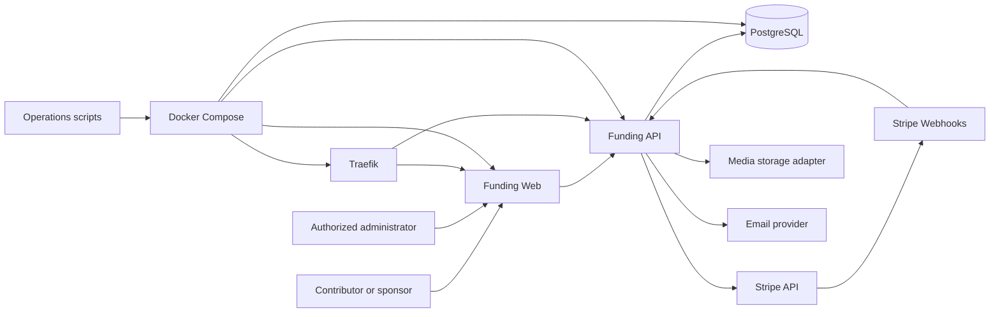
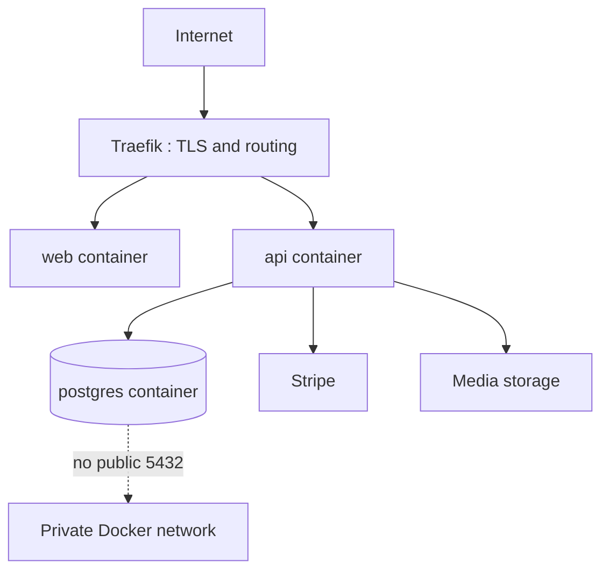
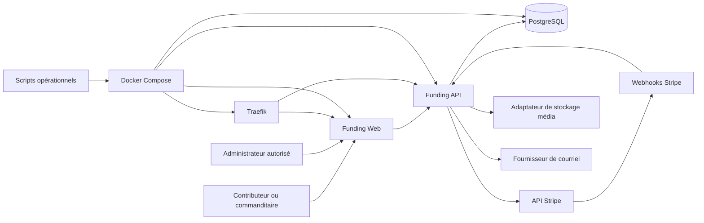
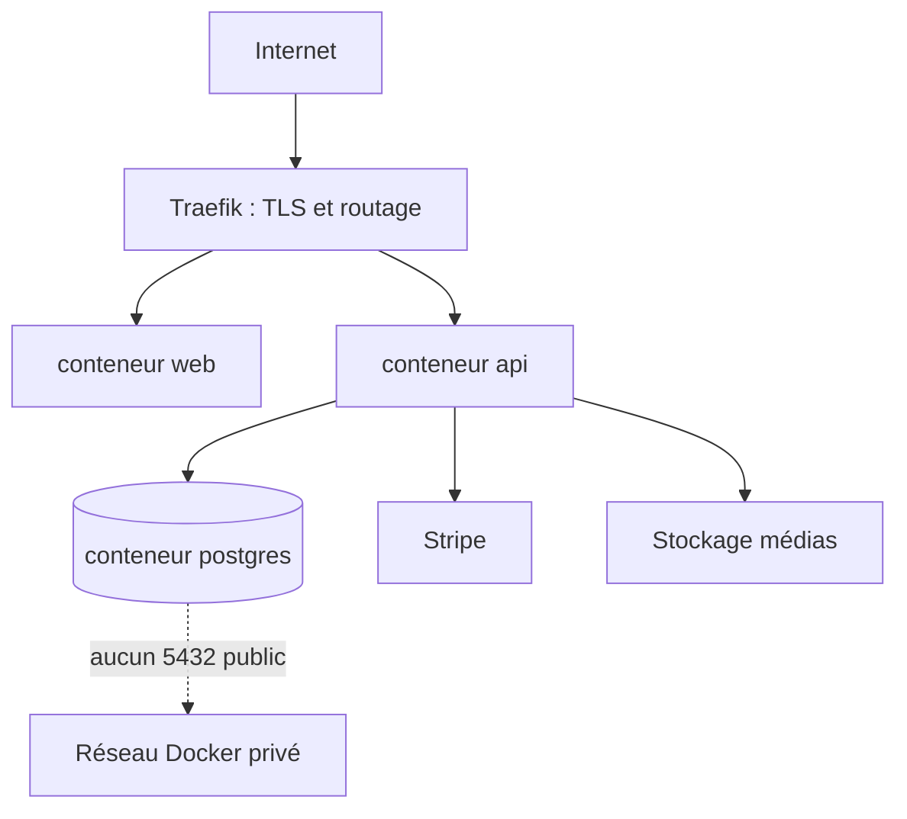

**Languages:** [English](#english) | [Français](#francais)

<a id="english"></a>

# OpenG7 Funding Platform Architecture

This document defines the durable architectural principles of the `openg7-funding-platform` repository. It describes the boundaries between the public funding experience, the administration interface, the funding API, PostgreSQL, Stripe, media storage, accounting capabilities, reconciliation, and the Docker/VPS runtime.

`ARCHITECTURE.md` explains **why, where, and which system is authoritative**. [`AGENTS.md`](../AGENTS.md) defines **how agents and contributors must execute the work**, including repository-specific commands, acceptance checks, and safety rules.

## Product Scope

`openg7-funding-platform` is the transparent funding engine for the OpenG7 ecosystem. It supports:

- voluntary personal contributions;
- business sponsorships with manual review and publication controls;
- Stripe Checkout and webhook-driven payment ingestion;
- public fund transparency;
- expenses, refunds, credit notes, fees, and net amounts;
- sponsor profiles, logos, supporting images, and publication planning;
- source attribution, including external campaigns such as La Ruche;
- audit trails, reconciliation, backups, and operational recovery.

The platform is not a charity receipt system. User-facing copy and receipts must not imply charitable status or a tax-deductible donation unless the legal status of the project changes and the architecture is explicitly updated.

## Architectural Principles

1. **Domain-first organization**: funding, payments, sponsorships, accounting, expenses, transparency, media, reconciliation, and audit are explicit business boundaries.
2. **Stripe is authoritative for payment-rail facts**: payment status, charge status, processor fees, net amounts, disputes, and Stripe refunds come from Stripe.
3. **PostgreSQL is authoritative for OpenG7 business state**: contribution metadata, sponsor review, public visibility, publication workflow, internal expenses, notes, credit-note records, source attribution, and audit history live in PostgreSQL.
4. **Webhooks, not browser redirects, confirm payments**: a `checkout=success` page may inform the user, but it never creates or confirms a financial transaction.
5. **Idempotency everywhere**: Stripe events, backfills, reconciliation repairs, refunds, email operations, and accounting writes must be safely repeatable.
6. **Append and compensate rather than erase**: financial corrections use refunds, credit notes, reversal entries, or status transitions. Confirmed financial history is not destructively rewritten.
7. **Manual publication boundary**: sponsorship payment does not automatically approve or publish a sponsor. Review, visibility, scheduling, and publication remain explicit admin actions.
8. **Least privilege and explicit confirmation**: high-risk actions inherit the confirmation level of the underlying operation, including actions proposed by an AI agent.
9. **Atomic Design as a UI composition taxonomy**: atoms, molecules, organisms, templates, and pages describe responsibility and complexity without imposing one global folder tree.
10. **Operability is part of the architecture**: health checks, backups, rollback, logs, reconciliation, and disaster recovery are first-class product capabilities.
11. **Privacy and data minimization**: OpenG7 stores Stripe identifiers and required business metadata, never raw card data.
12. **Configuration over hidden branching**: contribution amounts, sponsorship benefits, public-recognition rules, and environment behavior are explicit and testable.

## Sources of Truth

| Concern | Source of truth |
| --- | --- |
| Durable boundaries and dependency direction | `docs/ARCHITECTURE.md` |
| Agent workflow, commands, safety rules, and acceptance checks | `AGENTS.md` |
| Payment, charge, fee, net, dispute, and processor-refund facts | Stripe |
| Operational, sponsorship, publication, expense, and audit state | PostgreSQL |
| Financial projection derived from Stripe and internal operations | PostgreSQL accounting journal, reconciled against Stripe |
| Runtime topology | `docker-compose.yml` and environment-specific Compose files |
| Production operational procedures | `scripts/` and VPS documentation |
| Public transparency output | API projection exposed by the funding API |
| Secrets and environment configuration | Runtime environment and secret store; never Git |

No single browser page, cached UI state, or email is a financial source of truth.

## System Context



## Runtime Components and Responsibilities

### Funding Web

The Angular application under `apps/funding-web` owns:

- the public funding and transparency experience;
- contribution type and amount selection;
- Stripe Checkout initiation through the API;
- the post-checkout user experience;
- sponsor follow-up forms;
- protected administration pages;
- accessible, responsive, internationalized UI;
- local presentation state and domain-facing client adapters.

The web application must not:

- mark a payment as paid from a query parameter;
- calculate authoritative fees or net amounts;
- call Stripe secret APIs directly;
- publish a sponsor automatically after payment;
- bypass API permissions for admin actions.

### Funding API

The API service owns:

- Stripe Checkout session creation;
- Stripe webhook signature verification and ingestion;
- idempotent payment normalization;
- contribution, sponsorship, expense, refund, credit-note, and accounting operations;
- admin authorization and high-risk confirmations;
- public transparency projections;
- reconciliation and backfill jobs;
- media metadata and storage adapters;
- email and publication integrations;
- health and readiness endpoints.

The API is the only application layer allowed to combine Stripe facts with OpenG7 business state.

### PostgreSQL

PostgreSQL persists:

- normalized contributions and fund transactions;
- received Stripe events and processing status;
- sponsor organizations and contacts;
- sponsorship review, public visibility, and publication status;
- expenses and supporting records;
- refunds, credit notes, and accounting entries;
- fee and net projections;
- attribution sources and campaigns;
- reconciliation runs and findings;
- audit events, notes, and actor identity;
- media asset metadata.

PostgreSQL must remain private to the Docker network in production. Port `5432` must not be exposed publicly.

### Stripe

Stripe owns the payment rail. The platform stores Stripe references such as Checkout Session, PaymentIntent, Charge, Balance Transaction, Refund, and Event IDs, but does not store card numbers, CVC values, or raw payment credentials.

### Traefik

Traefik terminates TLS and routes public traffic to the `web` and `api` services. Database traffic is never routed publicly. Certificate renewal and route checks are operational responsibilities covered by the repository scripts.

### Media storage

Sponsor logos and supporting images are accessed through a storage abstraction. Development may use a local adapter; production should use a durable storage provider compatible with backup, access control, content-type validation, and future migration. Database records store metadata and stable object references, not large binary payloads.

## Repository Structure

The following is the target logical structure. Existing paths remain valid until a material change justifies migration.

```text
/ (repository root)
├─ apps/
│  ├─ funding-web/                 # Angular public and admin application
│  │  └─ src/app/
│  │     ├─ core/                  # Auth, config, HTTP, security, observability
│  │     ├─ shared/                # Business-neutral UI and utilities
│  │     └─ features/
│  │        ├─ funding/            # Contribution and checkout experience
│  │        ├─ transparency/       # Public financial projection
│  │        ├─ sponsors/           # Sponsor follow-up and public profile
│  │        └─ admin/              # Protected operational surfaces
│  └─ funding-api/                 # Payment and funding API
│     └─ src/
│        ├─ modules/
│        │  ├─ payments/
│        │  ├─ contributions/
│        │  ├─ sponsorships/
│        │  ├─ accounting/
│        │  ├─ expenses/
│        │  ├─ refunds/
│        │  ├─ transparency/
│        │  ├─ reconciliation/
│        │  ├─ media/
│        │  ├─ audit/
│        │  └─ health/
│        └─ infrastructure/        # Stripe, database, storage, email, HTTP
├─ packages/
│  ├─ contracts/                   # Shared API and domain contracts when present
│  └─ funding-ui/                  # Shared design tokens/components when extracted
├─ scripts/                        # Deploy, rollback, backup, restore, checks, migrations
├─ backups/                        # Local/runtime backup output; never committed
├─ docs/                           # Architecture and operational documentation
├─ docker-compose.yml
└─ AGENTS.md
```

A future `@openg7/accounting-core` package or dedicated accounting repository may be extracted only when a second real consumer exists and the contract is stable. Until then, accounting remains an internally modular domain rather than a premature distributed dependency.

## Front-End Architecture

### Domain-first feature structure

A feature owns its routed pages, use-case orchestration, domain UI, data access, and models.

```text
apps/funding-web/src/app/features/<feature>/
├─ pages/          # Routed entry points
├─ feature/        # Use-case orchestration and feature state
├─ ui/             # Domain-owned presentational components
├─ data-access/    # API clients and adapters
└─ models/         # Feature-specific types
```

Shared code is used only when its API and meaning are business-neutral or when real reuse exists in more than one context.

### Atomic Design adapted for Funding

| UI level | Definition | Business logic | Funding examples | Typical placement |
| --- | --- | --- | --- | --- |
| **Atom** | Indivisible visual or control primitive | None | button, amount badge, status chip, label, input shell | `shared/ui/primitives` |
| **Molecule** | Focused composition of atoms | None or minimal presentation state | amount selector, consent row, labeled money field, upload field | `shared/ui/composites` or feature `ui` |
| **Organism** | Complete reusable section | Presentation orchestration allowed | contribution card, sponsor review panel, transaction table, refund form | shared pattern or feature `ui` |
| **Template** | Responsive page scaffold | No data fetching or business decision | admin detail layout, transparency layout | feature `layouts` or `feature` |
| **Page** | Routed use-case entry point | Route, permissions, data loading, orchestration | funding page, sponsor admin page, expense page | feature `pages` |

Atomic Design does not justify global folders containing every atom or organism in the repository. Placement is determined by both composition level and business scope.

### Front-end dependency direction

```text
pages
  ↓
feature orchestration / templates
  ↓
feature organisms and UI
  ↓
shared patterns and composites
  ↓
shared primitives and design tokens
```

Dependencies must not point upward. Shared UI cannot import funding feature state or admin services.

### UI state rules

- Prefer Angular signals for local and feature-local state.
- Server-derived financial state is reloaded or invalidated after mutations.
- Optimistic UI must never imply that a refund, payment, or publication succeeded before server confirmation.
- Loading, empty, error, disabled, permission-denied, and partial-data states are required for admin organisms and pages.
- Mocked local checkout results must be visibly distinguishable from real Stripe success and must not create production-like records.

## API and Domain Architecture

### Domain modules

- **Payments**: Checkout sessions, Stripe identifiers, webhook ingestion, fees, net amounts, disputes.
- **Contributions**: contributor intent, amount, currency, public recognition, attribution source.
- **Sponsorships**: organization data, contact, review state, public profile, benefits, publication workflow.
- **Accounting**: append-only journal, financial projections, compensating entries, period and currency rules.
- **Expenses**: approved project spending, evidence, visibility, archiving.
- **Refunds**: Stripe refund requests and resulting financial state.
- **Credit notes**: OpenG7-issued correction documents linked to original records and compensating entries.
- **Transparency**: redacted, public projections derived from approved records.
- **Reconciliation**: Stripe-to-PostgreSQL comparison, backfill, safe repair, and exception review.
- **Media**: upload validation, storage, metadata, lifecycle.
- **Audit**: actor, action, target, before/after metadata, correlation, and result.

### Dependency direction

```text
HTTP controllers / jobs / webhook handlers
  ↓
application use cases
  ↓
domain services and policies
  ↓
repository and provider interfaces
  ↓
PostgreSQL / Stripe / storage / email adapters
```

Domain logic must not depend directly on Express, Stripe SDK response shapes, database clients, or storage SDKs. Adapters translate external data into internal contracts.

## Financial Authority and Consistency Model

The platform intentionally has two complementary authorities:

- **Stripe** is authoritative for what happened on the payment rail.
- **PostgreSQL** is authoritative for how OpenG7 classifies, reviews, explains, publishes, and accounts for those events.

A local row may temporarily be incomplete without becoming false. For example, a `payment_intent.succeeded` event may create the transaction before a Balance Transaction is available. A later `charge.updated` event may backfill `fee` and `net` values. These updates must modify the existing logical transaction idempotently rather than create a duplicate contribution.

All money values use integer minor units plus an explicit ISO currency code. Floating-point arithmetic is prohibited for persisted money.

## Payment and Webhook Flow

```mermaid
sequenceDiagram
  participant U as Contributor
  participant W as Funding Web
  participant A as Funding API
  participant S as Stripe
  participant D as PostgreSQL

  U->>W: Select type, amount, and consent
  W->>A: Request Checkout Session
  A->>S: Create Checkout Session with metadata
  S-->>A: Session identifier
  A-->>W: Redirect information
  W->>S: Hosted Checkout
  S-->>W: Browser redirect after Checkout
  Note over W: Informational only; not financial confirmation
  S->>A: Signed webhook event
  A->>D: Insert event inbox row using unique stripe_event_id
  A->>D: Normalize or update transaction idempotently
  A->>D: Create accounting projection and audit event
  A-->>S: 2xx after durable processing or safe acceptance
```

### Webhook rules

- Verify the Stripe signature using the raw request body.
- Store each `stripe_event_id` under a unique constraint.
- Acknowledge duplicate events safely.
- Keep event processing retryable and observable.
- Preserve the original event type and key external identifiers.
- `payment_intent.succeeded` may create or confirm the fund transaction.
- `charge.updated` may enrich the same transaction with Balance Transaction fee and net values.
- Never infer a successful payment only from the success URL.

## Contribution and Sponsorship Boundary

Selecting `sponsorship_interest` records intent; it does not publish a sponsor and does not call a publication API immediately.

After a successful Stripe-backed transaction:

1. the webhook creates or updates the contribution;
2. a sponsorship record may be created as `pending_review`;
3. the sponsor completes or updates its organization profile;
4. an authorized administrator reviews the record;
5. visibility and publication are separately approved, scheduled, drafted, or published;
6. every transition is audited.

### Current configurable recognition policy

The current sponsorship benefits are cumulative and expressed in the configured project currency:

- `5.00–24.99`: mention on OpenG7.org;
- `25.00–49.99`: OpenG7.org plus Facebook;
- `50.00+`: OpenG7.org plus Facebook and LinkedIn.

A mention on OpenG7.org is also available for personal contributions when the contributor grants public-recognition consent. Benefit eligibility never bypasses manual validation and never triggers automatic publication.

Business thresholds belong in typed configuration with tests, not scattered template conditions.

## Accounting, Refunds, and Credit Notes

### Accounting journal

The internal accounting model is append-oriented:

- confirmed entries are not deleted;
- corrections create compensating entries;
- every entry references its source operation;
- fees, gross, refunds, net, and expenses remain separately explainable;
- timestamps are stored in UTC;
- currency is explicit on every monetary record;
- idempotency keys prevent duplicate writes;
- accounting mutations produce audit events.

### Refund flow

1. an authorized admin opens the original transaction;
2. the API verifies eligibility and requires strong confirmation;
3. the API creates the refund through Stripe using an idempotency key;
4. Stripe webhooks confirm the external refund state;
5. PostgreSQL records the refund and compensating journal entries;
6. public transparency is recomputed from the resulting state;
7. failures and partial outcomes remain visible for retry or manual review.

A UI confirmation alone must not mark a refund completed.

### Credit notes

A credit note is an OpenG7 business/accounting record, not a substitute for a Stripe refund. It must:

- reference the original contribution or invoice-like record;
- include a reason and issue timestamp;
- preserve the original record;
- create the required compensating accounting entries;
- clearly state whether money was also refunded through Stripe;
- be auditable and idempotent.

## Reconciliation and Backfill

Reconciliation compares Stripe with PostgreSQL using PaymentIntent, Charge, Balance Transaction, Refund, and Event identifiers.

Each reconciliation run must support:

- a dry-run or report-only mode;
- a bounded date range or explicit object set;
- deterministic matching rules;
- safe automatic repair only for unambiguous differences;
- manual review for ambiguous, conflicting, or missing relationships;
- a persisted run summary and finding status;
- correlation IDs and audit events.

When PostgreSQL is enabled after Stripe transactions already exist, a controlled backfill reconstructs local projections from Stripe. It must not fabricate webhook history or duplicate transactions already present.

## Conceptual Data Model

| Entity | Responsibility |
| --- | --- |
| `Contribution` | Contributor intent, amount, currency, type, consent, attribution |
| `FundTransaction` | Normalized financial transaction and Stripe references |
| `StripeEvent` | Idempotent webhook inbox and processing state |
| `SponsorProfile` | Organization identity, contact, public content, logo, images |
| `SponsorshipReview` | Pending, approved, refused, and review metadata |
| `PublicationPlan` | Draft, scheduled, published, hidden, and external post links |
| `Expense` | Project expenditure, evidence, category, visibility, archive state |
| `Refund` | Stripe refund request and confirmed external state |
| `CreditNote` | Internal correction document and relationship to original record |
| `LedgerEntry` | Append-only accounting movement in minor units |
| `ReconciliationRun` | Comparison scope, summary, status, and findings |
| `AttributionSource` | Origin such as direct, campaign, partner, or La Ruche |
| `MediaAsset` | Storage key, metadata, owner, validation, lifecycle |
| `AuditEvent` | Actor, action, target, correlation, result, and safe metadata |

Sensitive information must be excluded from public projections and redacted from logs.

## API Contracts, Idempotency, and Correlation

- Mutating financial endpoints accept or generate an idempotency key.
- Stripe event IDs are globally unique in the local event inbox.
- API errors use stable machine-readable codes plus safe user-facing messages.
- Every high-value operation carries a correlation ID across API, audit, logs, and provider calls.
- Public contracts do not expose raw provider payloads, secrets, internal notes, or unnecessary personal information.
- Contract changes update clients, tests, and documentation in the same pull request.

Known public operational surfaces include:

- `/health` for service health;
- `/api/public/fund-transparency` for the redacted public projection.

Exact routes and payloads remain defined by the API implementation and `AGENTS.md`.

## Authentication, Authorization, and High-Risk Actions

Administrative routes and API operations require server-side authorization. Hiding a button or using an Angular guard is not security.

High-risk actions include:

- Stripe refunds;
- switching Stripe from test to live mode;
- destructive or externally visible accounting corrections;
- sponsor refusal when it creates irreversible side effects;
- production data restore;
- deployment, rollback, or database migration;
- bulk communication when it can affect many recipients.

Confirmation strength is based on real risk:

- low-risk reversible changes should avoid unnecessary confirmation;
- medium-risk visible changes use a lightweight confirmation;
- high-risk financial or irreversible changes require strong confirmation and an audit record.

### AI agent boundary

An AI agent may analyze, recommend, draft, or prepare an operation. It must not receive broader permissions than the human actor and must not bypass the normal API, confirmation, idempotency, or audit path. The agent inherits the confirmation level of the real action it proposes and is read-only by default.

## Media Architecture

Sponsor onboarding requires a logo when applicable and at least one supporting image according to current product rules.

Uploads must enforce:

- allowed MIME types and file-size limits;
- generated storage keys rather than trusting filenames;
- metadata persistence in PostgreSQL;
- access control for private or pending-review assets;
- safe replacement and orphan cleanup;
- image dimensions or transformations where required;
- no executable content served from trusted application origins.

Public pages receive only approved media references.

## Transparency and Privacy

The public transparency projection is a deliberate read model, not a database dump.

It may expose approved aggregates and records such as:

- gross contributions;
- processor fees;
- net funding;
- refunds and credit adjustments;
- approved expenses;
- public sponsor recognition;
- update timestamps and methodology notes.

It must not expose private email addresses, internal notes, Stripe secrets, unpublished sponsor profiles, raw webhook payloads, or unnecessary personal identifiers.

## Observability and Auditability

The platform should provide:

- structured logs with correlation IDs;
- webhook processing status and retry visibility;
- health and readiness checks;
- reconciliation metrics and unresolved findings;
- deployment and rollback records;
- admin audit history for financial and publication actions;
- alerts for repeated webhook failure, database unavailability, backup failure, or reconciliation drift.

Logs must not contain secrets, raw card data, full webhook payloads without redaction, database URLs, or private backup paths.

## Deployment Topology

Production runs on a Linux VPS using Docker Compose from:

```text
/opt/openg7-funding-platform
```

Operational Docker commands must be executed from that directory.



The primary runtime services are:

- `traefik`;
- `web`;
- `api`;
- `postgres`, enabled according to the Compose profile and environment.

Production secrets such as `.env`, `DATABASE_URL`, Stripe keys, webhook secrets, email credentials, and backup archives are never committed.

## Backups, Restore, and Recovery

- Create a backup before destructive database or deployment operations.
- Database backups and archive backups are secrets.
- Restore is a high-risk operation and must be explicitly targeted, logged, and followed by health and reconciliation checks.
- A successful container start is not sufficient proof of recovery; verify API health, public transparency, database connectivity, and Stripe reconciliation.
- Rollback must preserve the ability to migrate forward again and must not silently run incompatible schema changes.

Operational scripts include responsibilities such as:

- `scripts/deploy.sh`;
- rollback of previous web/API images;
- `scripts/backup.sh`;
- `scripts/restore-from-backup.sh`;
- database migrations;
- `scripts/check.sh`;
- log inspection;
- certificate renewal.

The exact command contract is maintained in `AGENTS.md` and script help output.

## Local Development and CI

Local development should preserve the same boundaries as production:

- Web communicates with the API, not directly with PostgreSQL or Stripe secret APIs.
- Stripe CLI or approved test webhooks exercise the real webhook path.
- Mock checkout is explicitly local-only.
- Database migrations are repeatable and reviewed.
- Secrets come from local environment files excluded from Git.

CI should validate, according to the scripts present in `package.json`:

- formatting and linting;
- unit and integration tests;
- Angular production build;
- API build and tests;
- database migration validity;
- webhook idempotency and signature tests;
- Stripe fee backfill behavior;
- refund and credit-note accounting behavior;
- public transparency projection;
- Docker or Compose configuration where applicable;
- `git diff --check`.

CI must never deploy, refund, switch to Stripe live mode, restore production data, or use production secrets during ordinary pull-request validation.

## Testing Strategy

| Layer | Required focus |
| --- | --- |
| UI primitives | accessibility, disabled/focus/error states |
| UI molecules and organisms | interaction, responsive behavior, permission states |
| Pages | routing, loading, errors, admin protection, end-to-end flows |
| Domain services | contribution, sponsorship, accounting, refund, publication policies |
| Stripe adapters | signature verification, event mapping, idempotency, fee/net backfill |
| Repositories | transaction boundaries, unique constraints, migrations |
| Reconciliation | deterministic matching, dry-run, safe repair, ambiguity handling |
| Operations | health, backup creation, restore checks, rollback readiness |

Financial tests must include repeated delivery, out-of-order delivery, partial provider data, retry after failure, and duplicate admin submission.

## Architecture Evolution

An Architecture Decision Record or explicit update to this document is required when a change:

- changes the authority boundary between Stripe and PostgreSQL;
- introduces another payment provider;
- extracts accounting into a shared package or separate repository;
- changes authentication or admin identity management;
- changes the public transparency methodology;
- exposes PostgreSQL or replaces the persistence engine;
- introduces a message broker or asynchronous worker platform;
- changes media storage provider or data residency;
- adds automatic sponsor publication;
- allows an AI agent to execute privileged actions;
- changes backup, restore, deployment, or rollback topology.

Update `ARCHITECTURE.md` for durable principles and `AGENTS.md` for executable implementation rules in the same pull request.

---

<a id="francais"></a>

# Architecture de la plateforme de financement OpenG7

Ce document définit les principes architecturaux durables du dépôt `openg7-funding-platform`. Il décrit les frontières entre l’expérience publique de financement, l’administration, l’API Funding, PostgreSQL, Stripe, le stockage des médias, les capacités comptables, la réconciliation et l’exécution Docker sur VPS.

`ARCHITECTURE.md` explique **pourquoi, où et quel système fait autorité**. [`AGENTS.md`](../AGENTS.md) définit **comment les agents et les contributeurs exécutent le travail**, notamment les commandes propres au dépôt, les validations et les règles de sécurité.

## Portée du produit

`openg7-funding-platform` est le moteur de financement transparent de l’écosystème OpenG7. Il prend en charge :

- les contributions personnelles volontaires;
- les commandites d’entreprise avec revue manuelle et contrôle de publication;
- Stripe Checkout et l’ingestion des paiements par webhooks;
- la transparence publique du fonds;
- les dépenses, remboursements, notes de crédit, frais et montants nets;
- les profils commanditaires, logos, images complémentaires et planification des publications;
- l’attribution de provenance, notamment les campagnes externes comme La Ruche;
- les pistes d’audit, la réconciliation, les sauvegardes et la récupération opérationnelle.

La plateforme n’est pas un système de reçus de charité. Les textes destinés aux utilisateurs et les reçus ne doivent jamais laisser entendre qu’une contribution est déductible d’impôt, sauf si le statut juridique change et que l’architecture est explicitement mise à jour.

## Principes architecturaux

1. **Organisation orientée domaines** : financement, paiements, commandites, comptabilité, dépenses, transparence, médias, réconciliation et audit sont des frontières métier explicites.
2. **Stripe fait autorité pour les faits du rail de paiement** : statut du paiement et de la charge, frais du processeur, montant net, litiges et remboursements Stripe proviennent de Stripe.
3. **PostgreSQL fait autorité pour l’état métier OpenG7** : métadonnées de contribution, revue des commandites, visibilité publique, publication, dépenses internes, notes, notes de crédit, provenance et historique d’audit résident dans PostgreSQL.
4. **Les webhooks, pas les redirections navigateur, confirment les paiements** : une page `checkout=success` peut informer l’utilisateur, mais ne crée ni ne confirme une transaction financière.
5. **Idempotence partout** : événements Stripe, backfills, réparations de réconciliation, remboursements, courriels et écritures comptables doivent pouvoir être rejoués sans duplication.
6. **Ajouter et compenser plutôt qu’effacer** : les corrections financières utilisent remboursements, notes de crédit, écritures inverses ou transitions de statut. L’historique financier confirmé n’est pas réécrit de façon destructive.
7. **Frontière de publication manuelle** : le paiement d’une commandite n’approuve ni ne publie automatiquement un commanditaire. La revue, la visibilité, la planification et la publication sont des actions admin distinctes.
8. **Moindre privilège et confirmation explicite** : les actions à risque élevé héritent du niveau de confirmation de l’opération réelle, y compris lorsqu’elles sont proposées par un agent IA.
9. **Atomic Design comme taxonomie UI** : atomes, molécules, organismes, templates et pages décrivent la responsabilité et la complexité sans imposer un arbre global unique.
10. **L’opérabilité fait partie de l’architecture** : santé, sauvegardes, rollback, logs, réconciliation et reprise après incident sont des capacités de premier ordre.
11. **Vie privée et minimisation** : OpenG7 conserve les identifiants Stripe et les métadonnées métier nécessaires, jamais les données brutes de carte.
12. **Configuration plutôt que branchement caché** : montants, avantages de commandite, règles de reconnaissance publique et comportement par environnement sont explicites et testables.

## Sources de vérité

| Sujet | Source de vérité |
| --- | --- |
| Frontières durables et direction des dépendances | `docs/ARCHITECTURE.md` |
| Processus des agents, commandes, sécurité et validations | `AGENTS.md` |
| Paiement, charge, frais, net, litige et remboursement processeur | Stripe |
| État opérationnel, commandite, publication, dépense et audit | PostgreSQL |
| Projection financière issue de Stripe et des opérations internes | Journal comptable PostgreSQL, réconcilié avec Stripe |
| Topologie d’exécution | `docker-compose.yml` et fichiers Compose par environnement |
| Procédures de production | `scripts/` et documentation VPS |
| Transparence publique | Projection exposée par l’API Funding |
| Secrets et configuration d’environnement | Environnement d’exécution et coffre de secrets; jamais Git |

Aucune page navigateur, donnée UI en cache ou courriel ne constitue une source de vérité financière.

## Contexte système



## Composants d’exécution et responsabilités

### Funding Web

L’application Angular sous `apps/funding-web` possède :

- l’expérience publique de financement et de transparence;
- le choix du type et du montant de contribution;
- l’initiation de Stripe Checkout à travers l’API;
- l’expérience après le retour de Checkout;
- les formulaires de suivi commanditaire;
- les pages d’administration protégées;
- une UI accessible, responsive et internationalisée;
- l’état local de présentation et les adaptateurs clients vers les domaines.

L’application Web ne doit jamais :

- marquer un paiement payé à partir d’un paramètre de requête;
- calculer les frais ou le net faisant autorité;
- appeler directement les API Stripe secrètes;
- publier automatiquement un commanditaire après paiement;
- contourner les permissions de l’API pour les actions admin.

### Funding API

Le service API possède :

- la création des sessions Stripe Checkout;
- la vérification de signature et l’ingestion des webhooks Stripe;
- la normalisation idempotente des paiements;
- les opérations de contribution, commandite, dépense, remboursement, note de crédit et comptabilité;
- l’autorisation admin et les confirmations à risque élevé;
- les projections publiques de transparence;
- la réconciliation et les backfills;
- les métadonnées médias et les adaptateurs de stockage;
- les intégrations de courriel et de publication;
- les endpoints de santé et de disponibilité.

L’API est la seule couche applicative autorisée à combiner les faits Stripe avec l’état métier OpenG7.

### PostgreSQL

PostgreSQL conserve :

- les contributions et transactions du fonds normalisées;
- les événements Stripe reçus et leur statut de traitement;
- les organisations commanditaires et contacts;
- la revue, la visibilité publique et l’état de publication;
- les dépenses et pièces justificatives;
- les remboursements, notes de crédit et écritures comptables;
- les projections de frais et de net;
- les sources et campagnes d’attribution;
- les exécutions de réconciliation et leurs anomalies;
- les événements d’audit, notes et identité de l’acteur;
- les métadonnées des actifs médias.

PostgreSQL demeure privé au réseau Docker en production. Le port `5432` ne doit jamais être exposé publiquement.

### Stripe

Stripe possède le rail de paiement. La plateforme conserve les références Stripe telles que les identifiants Checkout Session, PaymentIntent, Charge, Balance Transaction, Refund et Event, mais jamais les numéros de carte, CVC ou identifiants de paiement bruts.

### Traefik

Traefik termine TLS et route le trafic public vers `web` et `api`. Le trafic de base de données n’est jamais exposé. Le renouvellement des certificats et les contrôles de routes relèvent des scripts opérationnels du dépôt.

### Stockage des médias

Les logos et images de commanditaires passent par une abstraction de stockage. Le développement peut utiliser un adaptateur local; la production utilise un stockage durable compatible avec les sauvegardes, le contrôle d’accès, la validation des types et une migration future. PostgreSQL conserve les métadonnées et références stables, pas les gros fichiers binaires.

## Structure du dépôt

La structure suivante représente la cible logique. Les chemins existants demeurent valides jusqu’à ce qu’une modification importante justifie une migration.

```text
/ (racine du dépôt)
├─ apps/
│  ├─ funding-web/                 # Application Angular publique et admin
│  │  └─ src/app/
│  │     ├─ core/                  # Auth, config, HTTP, sécurité, observabilité
│  │     ├─ shared/                # UI et utilitaires neutres métier
│  │     └─ features/
│  │        ├─ funding/            # Contribution et Checkout
│  │        ├─ transparency/       # Projection financière publique
│  │        ├─ sponsors/           # Suivi et profil public commanditaire
│  │        └─ admin/              # Surfaces opérationnelles protégées
│  └─ funding-api/                 # API de paiement et financement
│     └─ src/
│        ├─ modules/
│        │  ├─ payments/
│        │  ├─ contributions/
│        │  ├─ sponsorships/
│        │  ├─ accounting/
│        │  ├─ expenses/
│        │  ├─ refunds/
│        │  ├─ transparency/
│        │  ├─ reconciliation/
│        │  ├─ media/
│        │  ├─ audit/
│        │  └─ health/
│        └─ infrastructure/        # Stripe, BD, stockage, courriel, HTTP
├─ packages/
│  ├─ contracts/                   # Contrats API et métier partagés lorsque présents
│  └─ funding-ui/                  # Tokens et composants lorsqu’ils sont extraits
├─ scripts/                        # Déploiement, rollback, backup, restore, checks, migrations
├─ backups/                        # Sorties locales/runtime; jamais commitées
├─ docs/                           # Architecture et documentation opérationnelle
├─ docker-compose.yml
└─ AGENTS.md
```

Un futur package `@openg7/accounting-core` ou dépôt comptable distinct ne sera extrait que lorsqu’un deuxième consommateur réel existera et que le contrat sera stable. D’ici là, la comptabilité reste un domaine interne modulaire plutôt qu’une dépendance distribuée prématurée.

## Architecture du front

### Structure de features orientée domaines

Une feature possède ses pages routées, son orchestration, son UI métier, son accès aux données et ses modèles.

```text
apps/funding-web/src/app/features/<feature>/
├─ pages/          # Points d’entrée routés
├─ feature/        # Orchestration et état de feature
├─ ui/             # Composants de présentation du domaine
├─ data-access/    # Clients API et adaptateurs
└─ models/         # Types propres à la feature
```

Le code partagé est utilisé seulement lorsque son API et sa signification sont neutres métier ou lorsqu’une réutilisation réelle existe dans plusieurs contextes.

### Atomic Design adapté à Funding

| Niveau UI | Définition | Logique métier | Exemples Funding | Emplacement typique |
| --- | --- | --- | --- | --- |
| **Atome** | Primitive visuelle ou de contrôle indivisible | Aucune | bouton, badge de montant, chip de statut, label, enveloppe d’input | `shared/ui/primitives` |
| **Molécule** | Assemblage ciblé d’atomes | Aucune ou état de présentation minimal | sélecteur de montant, ligne de consentement, champ monétaire, champ d’upload | `shared/ui/composites` ou `ui` de feature |
| **Organisme** | Section UI complète et réutilisable | Orchestration de présentation permise | carte de contribution, panneau de revue, table de transactions, formulaire de remboursement | pattern partagé ou `ui` de feature |
| **Template** | Squelette responsive de page | Aucun chargement ni décision métier | layout détail admin, layout transparence | `layouts` ou `feature` |
| **Page** | Point d’entrée routé d’un cas d’usage | Route, permissions, chargement, orchestration | page financement, page commanditaires admin, page dépenses | `pages` de feature |

Atomic Design ne justifie pas un ensemble global de dossiers contenant tous les atomes ou organismes du dépôt. Le placement dépend à la fois du niveau de composition et de la portée métier.

### Direction des dépendances front

```text
pages
  ↓
orchestration de feature / templates
  ↓
organismes et UI de feature
  ↓
patterns et composites partagés
  ↓
primitives et design tokens
```

Les dépendances ne remontent pas. L’UI partagée n’importe ni l’état de la feature Funding ni les services admin.

### Règles d’état UI

- Préférer les signals Angular pour l’état local et propre à une feature.
- Les données financières venant du serveur sont rechargées ou invalidées après une mutation.
- L’optimistic UI ne doit jamais laisser croire qu’un paiement, remboursement ou publication a réussi avant confirmation serveur.
- Les états chargement, vide, erreur, désactivé, accès refusé et données partielles sont obligatoires pour les organismes et pages admin.
- Les résultats de Checkout simulés sont clairement identifiés comme locaux et ne créent jamais d’enregistrements ressemblant à une confirmation de production.

## Architecture API et domaines

### Modules métier

- **Payments** : sessions Checkout, identifiants Stripe, webhooks, frais, net et litiges.
- **Contributions** : intention, montant, devise, reconnaissance publique et provenance.
- **Sponsorships** : organisation, contact, revue, profil public, avantages et publication.
- **Accounting** : journal append-only, projections, écritures compensatoires, périodes et devises.
- **Expenses** : dépenses approuvées, preuves, visibilité et archivage.
- **Refunds** : demandes Stripe et état financier résultant.
- **Credit notes** : documents de correction OpenG7 liés aux enregistrements originaux.
- **Transparency** : projections publiques expurgées issues des données approuvées.
- **Reconciliation** : comparaison Stripe/PostgreSQL, backfill, réparation et revue des exceptions.
- **Media** : validation d’upload, stockage, métadonnées et cycle de vie.
- **Audit** : acteur, action, cible, corrélation et résultat.

### Direction des dépendances

```text
contrôleurs HTTP / jobs / handlers webhook
  ↓
cas d’usage applicatifs
  ↓
services et politiques de domaine
  ↓
interfaces de repositories et fournisseurs
  ↓
adaptateurs PostgreSQL / Stripe / stockage / courriel
```

La logique de domaine ne dépend pas directement d’Express, des formes de réponse du SDK Stripe, du client de base de données ou des SDK de stockage. Les adaptateurs traduisent les données externes vers les contrats internes.

## Autorité financière et modèle de cohérence

La plateforme possède volontairement deux autorités complémentaires :

- **Stripe** fait autorité sur ce qui s’est produit sur le rail de paiement.
- **PostgreSQL** fait autorité sur la classification, la revue, l’explication, la publication et la comptabilisation OpenG7.

Une ligne locale peut être temporairement incomplète sans être fausse. Par exemple, `payment_intent.succeeded` peut créer une transaction avant que la Balance Transaction soit disponible. Un événement `charge.updated` ultérieur peut compléter `fee` et `net`. Cette mise à jour modifie la même transaction logique de façon idempotente plutôt que de créer une contribution en double.

Tous les montants sont stockés en unités mineures entières avec un code de devise ISO explicite. Les nombres flottants sont interdits pour les montants persistés.

## Flux de paiement et webhooks

```mermaid
sequenceDiagram
  participant U as Contributeur
  participant W as Funding Web
  participant A as Funding API
  participant S as Stripe
  participant D as PostgreSQL

  U->>W: Choisit type, montant et consentements
  W->>A: Demande une Checkout Session
  A->>S: Crée la session avec métadonnées
  S-->>A: Identifiant de session
  A-->>W: Information de redirection
  W->>S: Checkout hébergé
  S-->>W: Redirection navigateur
  Note over W: Information seulement; aucune confirmation financière
  S->>A: Événement webhook signé
  A->>D: Insère l’événement avec stripe_event_id unique
  A->>D: Normalise ou met à jour la transaction idempotemment
  A->>D: Crée la projection comptable et l’audit
  A-->>S: Réponse 2xx après traitement durable ou acceptation sûre
```

### Règles webhook

- Vérifier la signature Stripe à partir du corps brut.
- Conserver chaque `stripe_event_id` sous contrainte unique.
- Accepter les doublons sans effet secondaire.
- Garder le traitement rejouable et observable.
- Conserver le type d’événement original et les identifiants externes clés.
- `payment_intent.succeeded` peut créer ou confirmer la transaction du fonds.
- `charge.updated` peut enrichir cette transaction avec les frais et le net de la Balance Transaction.
- Ne jamais déduire un succès financier à partir de l’URL de retour.

## Frontière contribution et commandite

La sélection `sponsorship_interest` enregistre une intention; elle ne publie pas de commanditaire et ne déclenche pas immédiatement d’API de publication.

Après une transaction confirmée par Stripe :

1. le webhook crée ou met à jour la contribution;
2. une commandite peut être créée en état `pending_review`;
3. le commanditaire complète ou met à jour son profil;
4. un administrateur autorisé effectue la revue;
5. visibilité et publication sont approuvées, planifiées, mises en brouillon ou publiées séparément;
6. chaque transition est auditée.

### Politique configurable actuelle de reconnaissance

Les avantages actuels sont cumulatifs et exprimés dans la devise configurée du projet :

- `5,00–24,99` : mention sur OpenG7.org;
- `25,00–49,99` : OpenG7.org et Facebook;
- `50,00+` : OpenG7.org, Facebook et LinkedIn.

Une mention sur OpenG7.org est également offerte aux contributions personnelles lorsque la personne consent à la reconnaissance publique. L’admissibilité à un avantage ne contourne jamais la validation manuelle et ne déclenche aucune publication automatique.

Les seuils résident dans une configuration typée et testée, pas dans des conditions dispersées dans les templates.

## Comptabilité, remboursements et notes de crédit

### Journal comptable

Le modèle comptable interne est orienté ajout :

- les écritures confirmées ne sont pas supprimées;
- les corrections créent des écritures compensatoires;
- chaque écriture référence son opération source;
- brut, frais, remboursements, net et dépenses restent explicables séparément;
- les timestamps sont en UTC;
- la devise est explicite sur chaque montant;
- les clés d’idempotence préviennent les doublons;
- chaque mutation comptable crée un événement d’audit.

### Flux de remboursement

1. un admin autorisé ouvre la transaction originale;
2. l’API vérifie l’admissibilité et exige une confirmation forte;
3. l’API crée le remboursement Stripe avec une clé d’idempotence;
4. les webhooks Stripe confirment l’état externe;
5. PostgreSQL inscrit le remboursement et les écritures compensatoires;
6. la transparence publique est recalculée;
7. les échecs et résultats partiels restent visibles pour reprise ou revue.

Une confirmation UI ne peut jamais marquer seule un remboursement comme terminé.

### Notes de crédit

Une note de crédit est un enregistrement métier et comptable OpenG7, pas un substitut au remboursement Stripe. Elle doit :

- référencer la contribution ou le document original;
- inclure une raison et une date d’émission;
- préserver l’enregistrement original;
- créer les écritures compensatoires requises;
- indiquer clairement si un remboursement Stripe a aussi eu lieu;
- être auditée et idempotente.

## Réconciliation et backfill

La réconciliation compare Stripe et PostgreSQL à partir des identifiants PaymentIntent, Charge, Balance Transaction, Refund et Event.

Chaque exécution prend en charge :

- un mode dry-run ou rapport seulement;
- une période bornée ou un ensemble explicite d’objets;
- des règles de correspondance déterministes;
- une réparation automatique seulement pour les écarts non ambigus;
- une revue humaine pour les relations ambiguës, contradictoires ou manquantes;
- un résumé et un statut persistés;
- des identifiants de corrélation et événements d’audit.

Lorsque PostgreSQL est activé après l’existence de transactions Stripe, un backfill contrôlé reconstruit les projections locales. Il ne fabrique pas un faux historique de webhooks et ne duplique pas les transactions déjà présentes.

## Modèle de données conceptuel

| Entité | Responsabilité |
| --- | --- |
| `Contribution` | Intention, montant, devise, type, consentement et provenance |
| `FundTransaction` | Transaction normalisée et références Stripe |
| `StripeEvent` | Inbox idempotente des webhooks et état de traitement |
| `SponsorProfile` | Organisation, contact, contenu public, logo et images |
| `SponsorshipReview` | En attente, approuvée, refusée et métadonnées de revue |
| `PublicationPlan` | Brouillon, planifié, publié, masqué et liens externes |
| `Expense` | Dépense, preuve, catégorie, visibilité et archivage |
| `Refund` | Demande Stripe et état externe confirmé |
| `CreditNote` | Document de correction et lien vers l’original |
| `LedgerEntry` | Mouvement comptable append-only en unités mineures |
| `ReconciliationRun` | Portée, résumé, statut et anomalies |
| `AttributionSource` | Provenance directe, campagne, partenaire ou La Ruche |
| `MediaAsset` | Clé de stockage, métadonnées, propriétaire et cycle de vie |
| `AuditEvent` | Acteur, action, cible, corrélation et résultat |

Les informations sensibles sont exclues des projections publiques et expurgées des logs.

## Contrats API, idempotence et corrélation

- Les endpoints financiers de mutation acceptent ou génèrent une clé d’idempotence.
- Les identifiants d’événements Stripe sont uniques dans l’inbox locale.
- Les erreurs API utilisent des codes machine stables et des messages utilisateur sûrs.
- Chaque opération importante porte un identifiant de corrélation dans l’API, l’audit, les logs et les appels fournisseurs.
- Les contrats publics n’exposent ni payload fournisseur brut, secret, note interne ou donnée personnelle superflue.
- Toute modification de contrat met à jour clients, tests et documentation dans la même pull request.

Les surfaces opérationnelles publiques connues comprennent :

- `/health` pour la santé du service;
- `/api/public/fund-transparency` pour la projection publique expurgée.

Les routes et payloads exacts demeurent définis par l’implémentation API et `AGENTS.md`.

## Authentification, autorisation et actions à risque

Les routes admin et opérations API sont protégées côté serveur. Masquer un bouton ou utiliser un guard Angular ne constitue pas une sécurité.

Les actions à risque élevé comprennent :

- les remboursements Stripe;
- le passage de Stripe test à live;
- les corrections comptables destructives ou visibles à l’extérieur;
- le refus de commandite lorsqu’il produit des effets irréversibles;
- la restauration de données de production;
- le déploiement, rollback ou migration de base;
- les communications groupées touchant plusieurs destinataires.

La force de confirmation dépend du risque réel :

- les changements réversibles à faible risque évitent les confirmations inutiles;
- les changements visibles à risque moyen utilisent une confirmation légère;
- les actions financières ou irréversibles exigent une confirmation forte et un audit.

### Frontière de l’agent IA

Un agent IA peut analyser, recommander, rédiger ou préparer une opération. Il ne reçoit jamais davantage de permissions que l’acteur humain et ne contourne ni l’API normale, ni la confirmation, ni l’idempotence, ni l’audit. Il hérite du niveau de confirmation de l’action réelle et demeure en lecture seule par défaut.

## Architecture des médias

L’onboarding commanditaire exige un logo lorsque pertinent et au moins une image complémentaire selon les règles produit actuelles.

Les uploads imposent :

- types MIME autorisés et limites de taille;
- clés de stockage générées plutôt que confiance dans le nom de fichier;
- métadonnées persistées dans PostgreSQL;
- contrôle d’accès pour les médias privés ou en attente;
- remplacement sûr et nettoyage des orphelins;
- dimensions ou transformations lorsque nécessaires;
- aucun contenu exécutable servi depuis les origines de confiance de l’application.

Les pages publiques reçoivent seulement les références médias approuvées.

## Transparence et vie privée

La transparence publique est un read model délibéré, pas une copie brute de la base.

Elle peut exposer des agrégats et enregistrements approuvés comme :

- contributions brutes;
- frais de processeur;
- financement net;
- remboursements et ajustements de crédit;
- dépenses approuvées;
- reconnaissance publique des commanditaires;
- date de mise à jour et notes méthodologiques.

Elle ne doit jamais exposer les courriels privés, notes internes, secrets Stripe, profils non publiés, payloads webhook bruts ou identifiants personnels inutiles.

## Observabilité et auditabilité

La plateforme fournit ou vise à fournir :

- des logs structurés avec identifiants de corrélation;
- la visibilité sur le traitement et les retries des webhooks;
- des contrôles de santé et disponibilité;
- des métriques de réconciliation et anomalies non résolues;
- un historique des déploiements et rollbacks;
- un audit admin des actions financières et de publication;
- des alertes lors d’échecs répétés de webhook, indisponibilité BD, échec de sauvegarde ou dérive de réconciliation.

Les logs ne contiennent ni secret, donnée brute de carte, payload webhook complet non expurgé, URL de base de données ou chemin privé de sauvegarde.

## Topologie de déploiement

La production s’exécute sur un VPS Linux avec Docker Compose depuis :

```text
/opt/openg7-funding-platform
```

Les commandes Docker opérationnelles sont toujours exécutées depuis ce dossier.



Les services principaux sont :

- `traefik`;
- `web`;
- `api`;
- `postgres`, activé selon le profil Compose et l’environnement.

Les secrets de production tels que `.env`, `DATABASE_URL`, clés Stripe, secrets webhook, identifiants courriel et archives de sauvegarde ne sont jamais commités.

## Sauvegardes, restauration et récupération

- Créer une sauvegarde avant une opération destructive sur la base ou le déploiement.
- Les dumps de base et archives sont des secrets.
- Une restauration est une action à risque élevé, explicitement ciblée, journalisée et suivie de contrôles de santé et réconciliation.
- Un démarrage réussi des conteneurs ne prouve pas la récupération; vérifier la santé API, la transparence publique, la connexion BD et la réconciliation Stripe.
- Le rollback préserve la possibilité de migrer à nouveau vers l’avant et ne lance pas silencieusement des changements de schéma incompatibles.

Les scripts opérationnels couvrent notamment :

- `scripts/deploy.sh`;
- le rollback des images web/API précédentes;
- `scripts/backup.sh`;
- `scripts/restore-from-backup.sh`;
- les migrations de base;
- `scripts/check.sh`;
- l’inspection des logs;
- le renouvellement des certificats.

Le contrat exact des commandes demeure dans `AGENTS.md` et l’aide des scripts.

## Développement local et CI

Le développement local conserve les mêmes frontières que la production :

- le Web communique avec l’API, jamais directement avec PostgreSQL ou les API Stripe secrètes;
- Stripe CLI ou des webhooks de test approuvés exercent le vrai chemin webhook;
- le Checkout simulé est strictement local;
- les migrations sont rejouables et révisées;
- les secrets proviennent de fichiers d’environnement exclus de Git.

La CI valide, selon les scripts présents dans `package.json` :

- formatage et lint;
- tests unitaires et intégration;
- build Angular de production;
- build et tests API;
- validité des migrations;
- signature et idempotence des webhooks;
- comportement de backfill des frais Stripe;
- remboursements et notes de crédit;
- projection de transparence publique;
- configuration Docker ou Compose lorsque pertinent;
- `git diff --check`.

La CI ne déploie, ne rembourse, ne passe Stripe en live, ne restaure les données de production et n’utilise les secrets de production pendant une validation ordinaire de pull request.

## Stratégie de tests

| Couche | Vérifications requises |
| --- | --- |
| Primitives UI | accessibilité, focus, désactivé et erreurs |
| Molécules et organismes | interaction, responsive et permissions |
| Pages | routage, chargement, erreurs, protection admin et E2E |
| Services de domaine | contribution, commandite, comptabilité, remboursement et publication |
| Adaptateurs Stripe | signature, mapping, idempotence et backfill frais/net |
| Repositories | transactions, contraintes uniques et migrations |
| Réconciliation | matching déterministe, dry-run, réparation sûre et ambiguïtés |
| Opérations | santé, création de backup, contrôles de restore et readiness rollback |

Les tests financiers couvrent la livraison répétée, le désordre des événements, les données fournisseur partielles, le retry après échec et la soumission admin en double.

## Évolution de l’architecture

Une décision d’architecture ou une mise à jour explicite est requise lorsqu’un changement :

- modifie la frontière d’autorité entre Stripe et PostgreSQL;
- introduit un autre fournisseur de paiement;
- extrait la comptabilité vers un package partagé ou un dépôt distinct;
- change l’authentification ou la gestion d’identité admin;
- modifie la méthodologie de transparence publique;
- expose PostgreSQL ou remplace le moteur de persistance;
- introduit un broker de messages ou une plateforme de workers;
- change le fournisseur de stockage ou la résidence des données;
- ajoute une publication automatique des commanditaires;
- permet à un agent IA d’exécuter des actions privilégiées;
- modifie la topologie de backup, restore, déploiement ou rollback.

Mettre à jour `ARCHITECTURE.md` pour les principes durables et `AGENTS.md` pour les règles exécutables dans la même pull request.

---

_Last updated / Dernière mise à jour: 2026-07-18_
