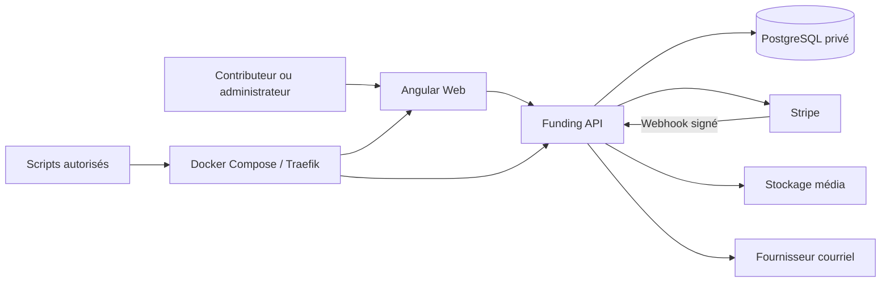

# Architecture de la plateforme de financement OpenG7

Référence française · [English](ARCHITECTURE.en.md). Lire une seule version.
Les deux versions doivent évoluer ensemble; les ajouts ne sont pas placés après
une traduction sans être reportés dans l'autre.

Ce document décrit les frontières durables et leurs raisons. Les consignes
d'exécution sont dans [AGENTS.md](../AGENTS.md); les contrats actuels et preuves
sont dans l'[index documentaire](README.md) et l'[état de la plateforme](platform-status.md).
Les frontières cibles ne prouvent ni une implémentation ni une activation en production.

## Produit et autorités

Le fonds prend en charge contributions personnelles, commandites, Checkout,
transparence, dépenses, remboursements/avoirs, médias, publication, audit et reprise.
L'import de sources externes telles que La Ruche demeure un
[cadrage](external-contributions-laruche-cadrage.md). Aucun reçu ou texte ne suggère
un statut de charité ou une déduction fiscale sans changement juridique explicite.

| Sujet                                                                                              | Autorité                                                  |
| -------------------------------------------------------------------------------------------------- | --------------------------------------------------------- |
| Paiement, charge, frais, net, litige, remboursement processeur                                     | Stripe                                                    |
| Contribution, consentement, revue, visibilité, publication, dépenses, documents, provenance, audit | PostgreSQL                                                |
| Projection comptable                                                                               | Journal PostgreSQL réconcilié avec les faits Stripe       |
| Présentation                                                                                       | Web, sans autorité financière ni autorisation de sécurité |
| Topologie, commandes, contrats exacts                                                              | Compose, manifests, implémentation et scripts             |
| Secrets                                                                                            | Environnement d'exécution et stockage protégé, hors Git   |

Le système conserve les identifiants Stripe et les métadonnées nécessaires, jamais
les données de carte. Un email, une URL ou un état UI n'est pas un fait financier.

## Composants et dépendances

```mermaid
flowchart LR
  visiteur[Contributeur ou administrateur] --> web[Angular Web]
  web --> api[Funding API]
  api --> db[(PostgreSQL privé)]
  api --> stripe[Stripe]
  stripe -->|Webhook signé| api
  api --> stockage[Stockage média]
  api --> courriel[Fournisseur courriel]
  ops[Scripts autorisés] --> compose[Docker Compose / Traefik]
  compose --> web
  compose --> api
```

| Chemin                         | Responsabilité                                                                          |
| ------------------------------ | --------------------------------------------------------------------------------------- |
| `apps/funding-web`             | Pages publiques/admin, contribution et suivi, accessibilité, i18n, état de présentation |
| `apps/funding-api`             | Autorisation, Checkout/webhooks, métier, projections, fichiers, files et adaptateurs    |
| `packages/funding-core`        | Règles et calculs déterministes indépendants des frameworks                             |
| `packages/funding-models`      | Types immuables et contrats neutres                                                     |
| `packages/funding-ui`          | Primitives et tokens réellement partagés                                                |
| `packages/funding-i18n`        | Clés et métadonnées de locales                                                          |
| `scripts`, `traefik`           | Exploitation, routage, santé, sauvegarde et reprise                                     |
| `apps/production-launch-agent` | Outil VPS optionnel soumis aux mêmes autorisations                                      |

Le Web appelle l'API; seule l'API combine faits Stripe et état métier. Les packages
n'importent pas `apps/**`, ne lisent pas `.env` et ne forment pas de cycles.
Ne pas extraire une dépendance distribuée ou un package comptable avant un second
consommateur réel et un contrat stable.

Front : pages → orchestration/templates → UI métier → composants neutres → tokens.
Atomic Design décrit atome, molécule, organisme, template et page; le domaine
décide du placement. Une primitive ne dépend ni du routeur/HTTP, ni d'un store ou
d'une session. Signals pour le local; NgRx seulement pour le durable partagé.
Rafraîchir l'état financier après mutation; aucun succès financier optimiste.
Le Web assure SSR, états complets, navigation accessible et traductions.

API : HTTP/jobs/webhooks → cas d'usage → domaine → ports → adaptateurs.
Les domaines sont paiement, contribution, commandite, comptabilité, dépense,
remboursement/avoir, transparence, réconciliation, média et audit. Le domaine
ne dépend pas de types Stripe, client SQL, serveur HTTP ou SDK de stockage.
Une organisation en modules est une direction, pas une exigence de déplacer les
fichiers existants. Les [consignes locales](../AGENTS.md#lectures-selon-la-tâche)
précisent les règles d'implémentation.

## Cohérence financière

1. Le navigateur choisit type, montant et consentement; l'API valide et crée Checkout.
2. Stripe redirige le navigateur : retour informatif, confirmation encore serveur.
3. L'API vérifie le webhook brut signé, déduplique l'événement et persiste les
   écritures liées de manière atomique, avec état de traitement, corrélation et audit.
4. Une transaction peut précéder ses frais : `charge.updated` enrichit le même
   fait à partir de Balance Transaction sans doubler la contribution.

Montants entiers en unités mineures, devise explicite, dates UTC. Les faits
confirmés sont append-only; erreurs corrigées par compensation, remboursement
ou avoir. Les documents émis sont des snapshots stables. Stripe confirme le
remboursement externe; l'avoir explique la correction interne et ne le remplace pas.

Les opérations répétables ont une clé d'idempotence et un état de reprise.
Une clé réutilisée avec un contenu incompatible produit un conflit. Les effets
externes sont découplés des transactions DB par des états persistants/files.
Ni publication distante ni remboursement ni courriel ne forme une transaction
distribuée avec PostgreSQL : représenter les issues partielles/ambiguës.

Réconciliation : comparer les objets Stripe aux événements, contributions,
transactions, remboursements et documents; borner le périmètre, rapporter/auditer
les écarts, ne réparer automatiquement que les cas déterministes. Un backfill
ne fabrique pas d'historique webhook et n'envoie pas de courriels sans option.
Les [règles financières](development/financial-rules.md) définissent les scénarios
et contrôles d'implémentation.

## Commandites et publication

Paiement, consentement, revue, visibilité et publication restent distincts.
Les avantages sont une configuration typée/testée, affichée avant paiement,
sans modification rétroactive implicite. Les seuils actifs appartiennent à
`DEFAULT_SPONSORSHIP_PRICING_CONFIG` et au [guide produit](public-sponsors.md).

Le moteur conserve une autorisation versionnée du texte exact, média, destination,
mode et horaire. La préparation récurrente est une proposition. Le worker réserve
atomiquement et revalide avant envoi; édition = révocation. Résultat externe
ambigu = quarantaine jusqu'à réconciliation ou déclaration humaine auditée.
Chaque feed a sa destination/pause; une simulation ne publie pas de commanditaire.

Les paiements confirmés avec consentement peuvent alimenter la préparation privée
avant revue. L'acceptation humaine peut approuver les dossiers et l'envoi dans une
transaction auditée, avec IDs/versions et photo approuvée, sans ouvrir leur
visibilité publique. Refus persistants, modifications humaines et autorisations
existantes sont préservés. Voir les [règles métier](development/sponsorship-rules.md)
et le [runbook](operations/publication-automation.md).

## Administration, agents et pilotage

L'API vérifie chaque droit. Le mode OIDC optionnel délègue authentification/MFA
au fournisseur; PostgreSQL possède comptes, rôles et sessions révocables.
Le mode token conserve ses garanties distinctes sans contourner OIDC. Les actions
sensibles exigent confirmation proportionnée et audit; secrets et données retournées
sont minimisés. Voir la [décision identité](decisions/2026-09-19-admin-identity-and-operations.md).
Les routes admin se chargent à la navigation; les URL inconnues gardent HTTP 404.

Le pilotage normalise clavier, contrôles visibles et Gamepad en intentions.
Il réutilise les services et un catalogue fermé de commandes, sans second calendrier
autoritaire ni seconde file d'envoi. Cible/version et confirmation accompagnent
la commande. Les reçus persistants liés à l'acteur empêchent les rejeux; un résultat
incertain entre reçu et mutation n'est jamais relancé implicitement. L'assistant IA
ne gagne aucun droit de mutation. Voir [ADR](decisions/2026-09-21-admin-controller.md)
et [runbook](operations/admin-pilotage.md).

Un agent peut analyser, proposer et préparer; il hérite des autorisations humaines,
du moindre privilège, des confirmations, de l'idempotence et de l'audit de l'action.
Une intégration IA administrative est en lecture seule par défaut; aucune
opération privilégiée implicite.

## Médias, modèle et confidentialité

Les entités conceptuelles relient contribution/transaction/événement Stripe,
profil/revue/plan de publication, dépense, remboursement/avoir/journal, source,
réconciliation, média et audit. Ces concepts ne remplacent pas les migrations.
Les données privées restent séparables des projections publiques.

Le stockage média est abstrait : binaires hors DB, clés générées, métadonnées
persistées, contrôle MIME/taille/contenu et accès privé avant approbation. Dimensions
et transformations selon le besoin, aucun contenu exécutable sous origine de confiance.
Sauvegarde, remplacement, nettoyage sûr des orphelins et migration doivent être prévus.

La transparence est une projection filtrée, jamais un export brut : agrégats,
allocations/dépenses approuvées, frais identifiés comme confirmés ou estimés, méthode
et dates. Aucun courriel privé, note admin, token ou profil non approuvé.
`status` d'allocation gouverne la visibilité; `progress_status` décrit l'avancement.
Les preuves publiques ne changent pas l'état financier. Stripe-direct et DB doivent
conserver la même sémantique et éviter le double comptage lors d'un changement de mode.

## Exploitation et évolution

En production, Compose est exploité depuis `/opt/openg7-funding-platform`.
Traefik termine TLS et expose Web/API; PostgreSQL reste privé sur `data`, sans
port public. Secrets et sauvegardes restent hors Git. Santé, logs corrélés, état
des webhooks, reprises et audits font partie de la capacité livrée.
Les alertes indépendantes et leurs limites sont décrites dans le
[runbook identité/alertes](operations/admin-identity-and-alerts.md).

Sauvegarder avant opération destructive; restaurer DB et médias de façon cohérente.
Vérifier santé, transparence, connectivité et réconciliation après reprise.
Un rollback d'images ne restaure pas implicitement la base. Les migrations ont une
[limite de réexécution actuelle](operations/database-migrations.md); une recette
sur base vide ne prouve pas une livraison répétée. Les procédures sont dans
[Docker/VPS](docker-deployment.md) et les [consignes scripts](../scripts/AGENTS.md).

Les [validations par changement](development/validation.md) distinguent tests,
builds, fixtures, intégrations et preuves externes. La CI ordinaire n'effectue
aucune opération financière, destructive ou de production implicite.

Créer/actualiser un ADR pour un changement d'autorité ou fournisseur de paiement,
base obligatoire/remplacée, extraction comptable, file externe/worker, fournisseur
courriel ou stockage/résidence/rétention, service déployable, frontière Web/API,
état global, identité admin, méthode de transparence, automatisation de publication
ou remboursement, droits d'un agent IA, topologie de sauvegarde/déploiement/rollback.
Mettre à jour les deux langues et les seules règles exécutables concernées ensemble.
