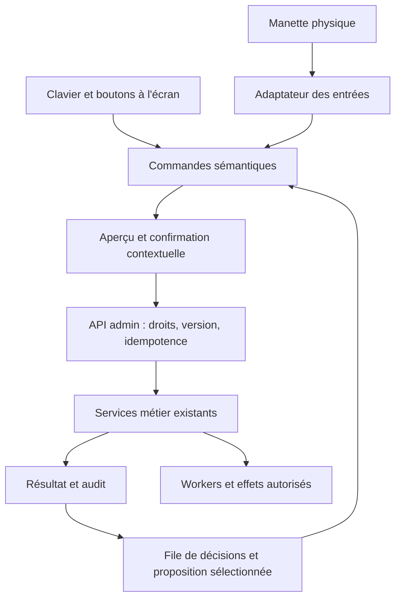

# Plan de travail — Pilotage de l’administration à la manette

Date : 21 septembre 2026. Statut : proposition de réalisation, non implémentée.

Ce plan répond à l’objectif suivant : la machine prépare le travail, l’administrateur prend ses décisions depuis une interface compacte pilotable à la manette, et le portail détaillé s’ouvre lorsque le besoin le justifie.

L’inspection porte sur le code local au commit `89a64b8`. Elle ne prouve ni le déploiement de cette version ni la compatibilité avec une manette physique. Le présent document est un changement à risque faible ; les futurs contrats de commande, mutations et migrations relèvent du risque modéré. Les opérations de production et financières réelles conservent leur procédure propre.

## 1. Expérience cible

L’administrateur ouvre `/admin/fundraiser/pilotage` — route proposée — et retrouve sa prochaine décision :

1. Un résumé explique la situation et pourquoi elle arrive maintenant.
2. La proposition montre le résultat attendu : contenu, destination, date, dossiers concernés et conséquences.
3. Une légende permanente affiche les boutons utilisables dans ce contexte.
4. L’administrateur accepte, refuse, modifie ou demande les détails.
5. L’interface attend le résultat serveur, l’affiche, puis permet de passer au dossier suivant.

L’écran contient une décision principale, une courte file des éléments suivants et un état discret du système. Les réglages, historiques et autres domaines restent accessibles dans un menu. Le calendrier existant devient une vue de supervision disponible depuis ce poste de commande.

La manette, le clavier, la souris et les boutons à l’écran utilisent les mêmes commandes métier. Le fonctionnement reste accessible sans matériel particulier. Les automatismes serveur continuent de fonctionner lorsque le navigateur est fermé.

## 2. Base existante et écarts

| Base inspectée                                                                                                                | Réutilisation                                                             | Travail manquant                                                                                                                                       |
| ----------------------------------------------------------------------------------------------------------------------------- | ------------------------------------------------------------------------- | ------------------------------------------------------------------------------------------------------------------------------------------------------ |
| [File de travail](../apps/funding-api/src/admin-work-queue.service.ts)                                                        | Priorités, échéances, regroupement et liens de dossiers                   | Réconcilier ses éléments avec les propositions du moteur de publication ; éviter les cartes en double et les demandes de préparation déjà automatisées |
| [Moteur de publications](../apps/funding-api/src/publication-automation/service.ts)                                           | Préparation, acceptation groupée, versions, refus, envoi différé et audit | Adaptateur vers une carte de décision commune ; exposition claire des blocages et du résultat                                                          |
| [Contrats de publication](../packages/funding-core/src/publication-automation.ts)                                             | Données exactes et commandes typées                                       | Modèle transverse de décision et de commande, sans recopier les états métier                                                                           |
| [Inspecteur de dossier](../apps/funding-web/src/app/features/funding/components/admin-inspector/admin-inspector.component.ts) | Détail contextuel                                                         | Ouverture à la manette et restauration de la sélection au retour                                                                                       |
| [Confirmation](../apps/funding-web/src/app/features/funding/services/admin-confirmation.service.ts)                           | Décision humaine explicite                                                | Protection contre le bouton maintenu et liaison au dossier, à sa version et à l’action affichée                                                        |
| [Layout admin](../apps/funding-web/src/app/features/funding/components/admin-layout/admin-layout.component.ts)                | Identité, navigation, recherche et composants communs                     | Mode compact et raccourci vers le pilotage                                                                                                             |
| [Assistant](../apps/funding-api/src/admin-assistant/tool-registry.ts)                                                         | Lecture et explications                                                   | Maintenir son registre en lecture seule ; ne pas lui donner implicitement accès aux nouvelles mutations                                                |
| Tests Node, PostgreSQL jetable et Playwright                                                                                  | Validation des règles et parcours                                         | Simulateur d’entrées de manette, scénarios de rupture et recette physique                                                                              |

Aucun adaptateur Gamepad n’a été trouvé dans le code inspecté. La préparation historique de l’assistant propose encore des étapes manuelles qui devront être harmonisées avec le moteur de publications.

## 3. Commandes proposées

Cette affectation constitue le profil initial à éprouver sur matériel réel. Les actions disponibles sont toujours affichées ; une commande indisponible indique sa raison.

| Entrée               | Sur une proposition                                | Dans un panneau ou une confirmation                                         |
| -------------------- | -------------------------------------------------- | --------------------------------------------------------------------------- |
| A                    | Accepter : ouvrir la confirmation de l’effet exact | Activer le contrôle sélectionné ; confirmer seulement après un nouvel appui |
| B                    | Demander le refus de la proposition                | Retour ou abandon de la confirmation, sans mutation                         |
| X                    | Ouvrir la modification ciblée                      | Action secondaire indiquée à l’écran                                        |
| Y                    | Ouvrir les détails du dossier                      | Développer le détail disponible                                             |
| LB / RB              | Décision précédente / suivante                     | Changer de section lorsqu’indiqué                                           |
| Croix directionnelle | Déplacer le focus ou changer une valeur            | Navigation des contrôles                                                    |
| Stick gauche         | Navigation avec seuil de mouvement                 | Navigation des contrôles                                                    |
| Stick droit          | Faire défiler le contenu                           | Faire défiler le panneau                                                    |
| Menu                 | Ouvrir le menu de pilotage                         | Revenir au menu de pilotage                                                 |
| View                 | Afficher l’aide des commandes                      | Afficher l’aide contextuelle                                                |
| LT + LB / RB         | Domaine précédent / suivant                        | Disponible uniquement hors formulaire                                       |
| LT + Y               | Ouvrir le calendrier                               | Disponible uniquement hors confirmation                                     |

Les combinaisons initiales servent à naviguer. Les actions métier avancées sont ajoutées au catalogue une par une, avec aperçu et confirmation adaptés. Aucune combinaison ne constitue une autorisation générale d’exécuter un script ou une série de mutations.

Une combinaison consomme ses boutons : `LT + Y` ne doit pas ouvrir simultanément le calendrier et les détails. Le relâchement des boutons est requis avant de réarmer une nouvelle décision. Une pression maintenue peut répéter un déplacement, jamais une acceptation, un refus ou un envoi.

Les corrections courantes disposent de contrôles ciblés : date, heure, média, variante de texte déjà préparée. Un éditeur compact permet le texte libre au clavier ; un clavier visuel peut compléter les corrections courtes à la manette. Une rédaction longue peut ouvrir le formulaire détaillé sans perdre le dossier courant.

## 4. Architecture proposée

**Entrées.** Un service Web normalise boutons, sticks, appuis et combinaisons. Il émet des intentions comme `decision.next`, `decision.accept` ou `details.open`. Il ne réalise aucune requête financière ou mutation directement et ne simule pas des clics dépendants du DOM.

**Présentation.** Une page Angular standalone, OnPush, avec signals pour la sélection, le contexte et les panneaux. Le service d’entrées est initialisé seulement dans le navigateur. Aucun accès à `navigator`, `window` ou à la manette pendant le rendu serveur.

**Décisions.** Une projection API agrège les sources existantes. Chaque carte possède un identifiant stable, un domaine, une cible, une version, les faits utiles, la proposition, les commandes disponibles avec leurs blocages, et un lien vers le détail. Une absence de source doit être signalée : elle ne devient pas une fausse file vide.

**Commandes.** Un catalogue fermé relie les identifiants de commande aux services métier existants. Chaque mutation déclare son entrée, ses droits, sa confirmation, son idempotence, son audit, ses erreurs et sa reprise. Le serveur détermine les autorisations et revalide l’état ; la disponibilité affichée côté Web n’est pas une frontière de sécurité.

**Résultats.** Distinguer « accepté et programmé », « action terminée », « état modifié par ailleurs », « refusé », « bloqué » et « résultat inconnu ». Une acceptation locale ne signifie jamais qu’une publication a été envoyée. Après un résultat réseau ambigu, consulter le statut de la commande avant toute reprise.

**Persistance.** Réutiliser les tables de domaine. Ajouter uniquement les données manquantes démontrées par le contrat : reçus idempotents de commandes et éventuel report d’une décision. Choisir le prochain numéro de migration disponible lors de l’implémentation. Les préférences nominatives supposent une identité OIDC ; le mode token partagé ne doit pas être présenté comme une identité individuelle.

**Assistant.** Les explications peuvent réutiliser l’assistant en lecture seule. Les propositions générées restent des données à examiner ; elles ne peuvent pas s’autoautoriser ni invoquer le catalogue des commandes humaines.

## 5. Lots de réalisation

Les critères distinguent la valeur visible pour l’utilisateur et les preuves nécessaires au fonctionnement fiable. Les tailles S/M/L sont relatives, pas des estimations calendaires.

### Lot 1 — Contrat d’usage et prototype de la manette · M

- Inventorier les actions admin et les classer : consulter, préparer, modifier, approuver, envoyer, opération exceptionnelle.
- Dessiner les états sélection, détails, correction, confirmation, attente et résultat ; fixer le comportement de B dans chacun.
- Créer un prototype local qui affiche les entrées reçues, sans mutation métier.
- Qualifier d’abord Xbox One sur Windows avec USB, puis Bluetooth si le matériel le permet ; cibler initialement Chrome et Edge, versions consignées lors des essais.
- Détecter l’API absente, l’autorisation navigateur indisponible, la connexion, la déconnexion et les dispositions non standard.
- Rédiger une décision d’architecture avant l’introduction du nouveau contexte de commande partagé.

**Valeur :** la manette permet de parcourir une file simulée et ses boutons sont compréhensibles à l’écran.

**Preuve :** essai physique consigné ; aucune action issue d’un appui tenu au branchement ; profil non reconnu sans commande métier active.

### Lot 2 — Projection des décisions et contrat de commande · L

- Définir les types de carte, action disponible, conséquence, précondition et résultat.
- Brancher d’abord les publications `draft`, `blocked` et `uncertain`, puis leurs liens de commanditaires.
- Dédupliquer les éléments historiques de la file d’attention par objet métier et décision attendue.
- Définir une priorité explicable : blocage actif, échéance, ancienneté ; conserver l’ordre pendant la lecture.
- Ajouter les adaptations API nécessaires : liste paginée, détail versionné, exécution bornée et lecture du résultat d’une commande.
- Réutiliser l’authentification, les rôles, contrôles d’origine et services métier actuels.
- Étudier les reçus idempotents et les migrations strictement nécessaires.

**Valeur :** une publication et sa revue groupée apparaissent comme une décision cohérente, avec une raison précise lorsqu’elle est bloquée.

**Preuve :** tests de droits, versions obsolètes, déduplication, deux administrateurs concurrents, double soumission et disponibilité partielle des sources.

### Lot 3 — Écran de pilotage compact · M

- Ajouter la route proposée et son accès depuis le layout admin.
- Afficher la carte courante, les prochaines décisions, la légende, l’état de connexion et les compteurs utiles.
- Réutiliser l’aperçu exact des publications, les médias authentifiés, l’inspecteur et le calendrier.
- Ouvrir un panneau de correction ciblé avec conservation des changements non enregistrés.
- Prévoir chargement, file vide, erreur, absence de permission, session expirée et résultat serveur incertain.
- Restaurer filtre, sélection et focus après une visite du portail détaillé.
- Livrer les textes FR/EN, la navigation clavier et le responsive.

**Valeur :** consulter, corriger une date, examiner les commanditaires et revenir à la file sans parcourir plusieurs pages.

**Preuve :** tests navigateur clavier/souris, focus, lecteur d’écran, axe et rendu SSR, avant de dépendre de la manette.

### Lot 4 — Adaptateur Gamepad et routage du contexte · M

- Lire les états Gamepad et convertir les transitions en intentions.
- Ajouter zone neutre des sticks, seuils des gâchettes, répétition maîtrisée pour la navigation et arbitrage des combinaisons.
- Choisir une seule manette active et gérer son remplacement explicitement.
- Donner la priorité au panneau ouvert : une action de confirmation ne doit pas atteindre aussi la carte située derrière.
- Suspendre les commandes à la perte de focus, au masquage de l’onglet, à la déconnexion et à l’expiration de session.
- Après retour, exiger des boutons relâchés avant de reprendre.
- Conserver toutes les commandes disponibles au clavier et à l’écran ; vibrations facultatives, jamais indispensables à la compréhension.

**Valeur :** le parcours du lot 3 devient entièrement navigable à la manette.

**Preuve :** simulateur déterministe et essai réel vérifient qu’un maintien, une reconnexion ou une combinaison ne déclenche pas de mutation supplémentaire.

### Lot 5 — Publications de bout en bout · L

- Relier A à l’acceptation groupée de la publication et des commanditaires explicitement présentés.
- Relier B au refus persistant ; distinguer refus, passage au suivant et annulation d’un envoi autorisé.
- Relier X à l’édition et Y au dossier, avec retour sur la même décision.
- Afficher les prérequis manquants : paiement, consentement, photo approuvée, connexion ou date.
- Ne pas déplacer une carte en cours de lecture lors d’une actualisation ; signaler une nouvelle version et imposer sa relecture.
- Montrer la confirmation du serveur avant de retirer la décision de la file.
- Permettre la pause d’un feed depuis le menu, avec une portée clairement affichée.
- Distinguer arrêt de la capture manette, pause des envois et arrêt du worker : ces actions ont des effets différents.
- Conserver le traitement particulier des envois incertains, qui demandent une investigation.

**Valeur :** une session complète de revue de publications se fait dans le pilotage, avec ouverture du portail uniquement pour les dossiers qui le demandent.

**Preuve :** en simulation, paiement confirmé → préparation → revue à la manette → acceptation → envoi programmé ; refus, retrait du consentement, conflit de version et interruption réseau couverts.

**Fin du premier produit utilisable : lots 1 à 5.**

### Lot 6 — Réglages de pilotage et gestes avancés · M

- Ajouter aide visuelle, calibration des entrées non standard et réglage de sensibilité.
- Permettre la réaffectation d’un ensemble limité de commandes, avec détection des conflits et retour au profil initial.
- Introduire le report d’une décision si le besoin est confirmé, distinct d’un refus et sans masquer définitivement un problème.
- Ajouter seulement les combinaisons utiles observées pendant la recette, avec leur légende.
- Ajouter les retours visuels et, si disponibles, les vibrations facultatives.
- Évaluer un clavier visuel pour les corrections courtes sans clavier physique.

**Valeur :** usage confortable sans mémoriser une grande liste de combinaisons.

**Preuve :** un profil mal configuré n’empêche jamais le retour au clavier, à l’aide ou au profil par défaut.

### Lot 7 — Extension aux autres domaines · L, par incréments

| Domaine                                | Commandes à intégrer                                                                      | Cas qui ouvrent le détail                                          |
| -------------------------------------- | ----------------------------------------------------------------------------------------- | ------------------------------------------------------------------ |
| Commanditaires                         | Consulter, modifier les informations utiles, examiner les médias et les demandes de revue | Correction longue, pièce manquante ou situation inhabituelle       |
| Courriels                              | Lire l’échec, prévisualiser une relance, autoriser une tentative ciblée                   | Adresse à corriger, ambiguïté de livraison, relance massive        |
| Factures                               | Consulter le document et l’état d’émission ; préparer les actions déjà permises           | Correction comptable ou intervention fournisseur                   |
| Contributions et événements Stripe     | Lire les faits confirmés et expliquer les anomalies                                       | Remboursement, backfill live ou correction financière              |
| Dépenses, réalisations et transparence | Examiner une proposition et son effet public ; utiliser les validations existantes        | Modification comptable ou justification détaillée                  |
| État opérationnel                      | Lire les incidents, consulter l’activité, accéder aux réglages et pauses disponibles      | Secrets, déploiement, migration, restauration ou diagnostic avancé |

Chaque domaine apporte un adaptateur de décisions, un sous-ensemble explicite de commandes, les droits, l’audit et ses tests. Les interventions financières et de production conservent leur parcours dédié ; la manette peut y conduire et aider à les examiner, sans les transformer en raccourcis aveugles.

**Valeur :** même grammaire de pilotage dans tous les domaines, sans obliger l’administrateur à apprendre une nouvelle interface par module.

**Preuve :** aucun nouveau domaine ne contourne ses règles existantes ; un résultat incomplet n’est pas présenté comme un succès.

### Lot 8 — Recette, mesure et activation progressive · M

- Tester le parcours complet sur données réalistes mais fictives, en environnement isolé.
- Vérifier USB et, lorsque disponible, Bluetooth : veille, réveil, débranchement, batterie, perte de focus et changement de manette.
- Exécuter la matrice navigateur réellement supportée et consigner ses limites.
- Mesurer les tâches terminées dans le pilotage, les ouvertures du portail détaillé et les corrections d’actions ; conserver des compteurs minimaux, sans journal brut des entrées physiques ni contenu privé.
- Activer le nouveau poste de commande de manière réversible. Son retrait ne doit ni supprimer les autorisations existantes ni arrêter implicitement les workers.
- Mettre à jour l’architecture, les règles d’exécution et le runbook avec les résultats observés.

**Valeur :** le pilotage réduit les déplacements dans le portail, avec des raisons identifiées pour les exceptions restantes.

**Preuve :** tests applicables verts, recette réelle consignée, aucune double mutation liée à la manette et accès au portail classique toujours disponible.

## 6. Découpage des PR et dépendances

| PR proposée | Contenu                                                                                   | Dépendance                                                             |
| ----------- | ----------------------------------------------------------------------------------------- | ---------------------------------------------------------------------- |
| 1           | Décision d’architecture, contrat d’usage, prototype de détection et simulateur            | Base publications intégrée ou branche de travail dépendante explicitée |
| 2           | Contrats et projection des décisions, catalogue fermé des mutations, éventuelle migration | PR 1                                                                   |
| 3           | Écran compact, panneaux, clavier/souris et restauration de contexte                       | PR 2                                                                   |
| 4           | Entrées physiques, combinaisons, isolation des contextes, profil initial                  | PR 1 et PR 3                                                           |
| 5           | Parcours publication complet, documentation et recette du premier jalon                   | PR 2 à 4                                                               |
| 6           | Personnalisation, aide et améliorations issues de l’usage                                 | PR 5                                                                   |
| Suivantes   | Un domaine métier par PR, puis recette transversale                                       | Premier jalon éprouvé                                                  |

Vérifier le statut de la PR publications avant de créer les branches. Ne pas incorporer silencieusement des changements non livrés d’une autre branche. L’état du runner de migrations sur base existante doit être traité selon le [runbook](operations/database-migrations.md) avant toute activation nécessitant une nouvelle migration.

## 7. Validation et critères de sortie

| Axe                | Critère vérifiable                                                                                                                                         |
| ------------------ | ---------------------------------------------------------------------------------------------------------------------------------------------------------- |
| Valeur utilisateur | Au moins une session de 20 décisions représentatives permet de consulter, accepter, refuser, changer de date et ouvrir/refermer un dossier avec la manette |
| Friction           | Les cas courants de publication se terminent sans ouvrir le portail complet ; les exceptions restantes sont expliquées et comptées                         |
| Exactitude         | Aucun bouton maintenu, double appui, conflit de contexte ou retour d’onglet n’entraîne une double mutation                                                 |
| Autorité           | Droits, paiement, consentement et versions revalidés côté API ; l’assistant ne peut pas déclencher une commande humaine                                    |
| Réseau             | Une coupure n’affiche pas un faux succès et ne rejoue pas une opération ambiguë                                                                            |
| Coexistence        | Portail, pilotage et workers partagent les mêmes décisions ; aucun second calendrier autoritaire ni file d’envoi concurrente                               |
| Accessibilité      | Parité clavier, focus visible/restauré, noms accessibles, annonces d’état, FR/EN et SSR                                                                    |
| Matériel           | Modèle, transport, système et navigateur réellement testés sont documentés ; une simulation Playwright ne remplace pas cette preuve                        |
| Exploitation       | Activation réversible de l’interface, traces minimales des commandes et distinction claire entre pause manette et pause des envois                         |

Tests à prévoir : fonctions pures du décodage des entrées, PostgreSQL jetable pour concurrence/idempotence/migrations, Playwright avec une source d’entrées injectable, puis recette physique. Exécuter les commandes applicables du dépôt : `yarn lint`, `yarn build`, `yarn test`, compilation Angular/SSR, contrôles admin, E2E ciblés et `git diff --check`.

Ce plan n’atteste aucun test matériel ni nouveau parcours exécuté. Sa validation actuelle est documentaire : inspection du code, cohérence avec les règles du dépôt et vérification des liens.

## 8. Référence technique et premier jalon

La [spécification Gamepad du W3C](https://www.w3.org/TR/gamepad/) fournit les états des boutons/axes, les événements de connexion et le mapping standard. Elle prévoit que la visibilité d’une manette puisse attendre une interaction et que la disposition soit standard ou brute. L’implémentation devra donc détecter les capacités et guider l’utilisateur ; la compatibilité de son matériel reste à vérifier en pratique. Les vibrations sont facultatives.

Le premier jalon concret est une file de publications pilotable, avec aperçu exact, **A accepter / B refuser / X modifier / Y détails**, confirmation contextuelle, résultat serveur et retour au dossier suivant. Ce jalon permettra de valider l’usage avant d’étendre les commandes à toute l’application.

## 9. Réalisation sur la branche de pilotage

Les lots logiciels sont implémentés sur `feat/admin-controller-pilotage` :
projection, commandes et reçus, écran de référence, entrées natives, parcours de
publication, réglages/calibration, clavier visuel et adaptateurs des autres
domaines. Les corrections longues et opérations financières utilisent les liens
vers leurs dossiers complets, conformément au périmètre du lot 7. Le report
facultatif ne crée pas de nouvel état métier : passer au dossier suivant le laisse
dans la file.

La recette matérielle USB/Bluetooth et l’activation de production restent
distinctes du travail logiciel. Le [runbook](operations/admin-pilotage.md) décrit
les parcours livrés, les limites de la projection, les commandes de test et les
preuves restant à recueillir sur une manette réelle.
