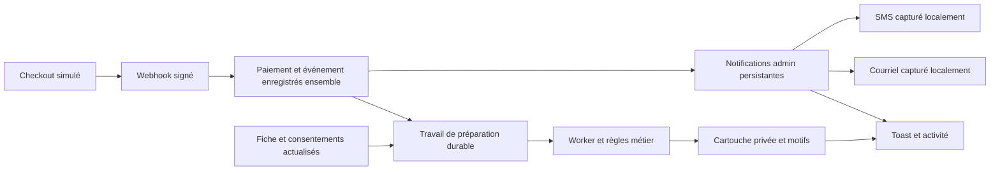

# Contribution d’entreprise de 50 CAD : analyse du parcours virtuel

Analyse du 22 septembre 2026, révision `feed17ed0861a166118a63763195a63cc6933b6d`.
**Statut : diagnostic historique à la révision indiquée et proposition initiale.**
L’implémentation qui suit est décrite dans le
[guide des contributions reçues](../operations/contribution-activity.md).

## Périmètre retenu

Une entreprise synthétique contribue **50 CAD**, soit **5 000 unités mineures**.
Le paiement, les courriels et les SMS sont simulés. Un administrateur connecté
reçoit un toast, peut consulter les décisions de l’application et suivre la
préparation privée d’une cartouche par le worker. Les trois canaux demandés
sont complémentaires : toast, courriel et SMS.

Le scénario conserve les engagements actuels : à ce montant, la destination
normale est la mention sur le site. La configuration partagée prévoit Facebook
à partir de 250 CAD et LinkedIn à partir de 500 CAD. Une destination sociale
explicitement attribuée par l’administration est un cas distinct ; elle ne doit
pas être ajoutée discrètement à la simulation pour obtenir un résultat positif.
Source : `DEFAULT_SPONSORSHIP_PRICING_CONFIG` dans
[funding-core](../../packages/funding-core/src/index.ts).

La proposition est donc une **cartouche privée pour la mention Web** à 50 CAD.
Le worker actuel prépare uniquement les destinations sociales : ce parcours Web
demande un ajout fonctionnel. Une publication sociale dès 50 CAD demanderait
une décision produit différente, absente de ce cadrage.

## Ce que le dépôt fait aujourd’hui

| Étape                 | Existant observé                                                                                                                           | Écart avec le parcours demandé                                                                                                               |
| --------------------- | ------------------------------------------------------------------------------------------------------------------------------------------ | -------------------------------------------------------------------------------------------------------------------------------------------- |
| Checkout              | L’API crée la session et une contribution en attente.                                                                                      | La recette doit commencer par le formulaire réel, sans injecter une contribution déjà payée.                                                 |
| Confirmation          | Le webhook vérifie la signature Stripe et met à jour le paiement. Les événements répétés disposent de protections.                         | Il manque un événement métier durable de première confirmation, consommable par les notifications.                                           |
| Identité d’entreprise | La fiche peut être complétée après le paiement. Un nom public peut exister avant la fiche complète.                                        | Le toast doit afficher la référence et les données réellement disponibles, puis se mettre à jour.                                            |
| Courriels             | La confirmation de commandite peut mettre en file le lien de suivi et la facture pour le contributeur. La file gère livraison et reprises. | Ces messages ne constituent pas une alerte immédiate de paiement à l’admin. Ajouter un modèle admin et sa distribution.                      |
| Alertes admin         | Rappels de revue, notification de lot plein et alertes techniques existent.                                                                | Le rappel de revue attend par défaut un jour ; les incidents techniques ne décrivent pas les paiements réussis.                              |
| Toast                 | Des retours locaux d’action existent dans certaines pages.                                                                                 | Aucun flux global de nouvelles contributions ni toast de paiement reçu n’a été trouvé.                                                       |
| SMS                   | Aucun adaptateur ni configuration SMS trouvé dans les sources examinées.                                                                   | Ajouter un contrat et un récepteur simulé, avec suivi des tentatives.                                                                        |
| Worker                | Prépare des brouillons et lots Facebook/LinkedIn admissibles ; l’envoi reste soumis à approbation.                                         | Aucun brouillon social par défaut à 50 CAD, aucune préparation de cartouche Web, aucune explication individuelle persistante des exclusions. |
| Suivi                 | Un contrat de progression expose paiement, identité, médias, revue, facturation et publications.                                           | L’étendre pour expliquer préparation, attente et notifications ; ne pas créer un second dossier concurrent.                                  |

Les points d’entrée sont le [webhook](../../apps/funding-api/src/stripe-webhook.service.ts),
le [repository des contributions](../../apps/funding-api/src/fund-contributions.repository.ts),
les [courriels](../../apps/funding-api/src/email-notification.service.ts), le
[worker](../../apps/funding-api/src/publication-automation/service.ts) et la
[projection de progression](../../apps/funding-api/src/sponsorship-progress.service.ts).

Deux délais doivent rester visibles. Le worker est appelé toutes les 30 secondes,
mais la préparation périodique d’un même feed est espacée d’au moins cinq minutes.
Son interrupteur global peut également être arrêté. Une confirmation de paiement
ne permet donc pas d’afficher immédiatement « publication prête ».

La mention publique sur le site possède ses propres conditions : consentement,
revue approuvée, nom d’entreprise, image de soutien approuvée et absence de maintien
privé. Préparer une cartouche ne doit modifier aucune de ces décisions.

## Vérification réellement exécutée

Une répétition des services backend a été exécutée sous Node 22 dans un PostgreSQL
jetable, après `yarn build`. Elle utilise le vrai vérificateur de signature, le
repository et le worker compilés, avec des événements synthétiques signés et le
mode social `mock`. SMTP est désactivé ; les courriels sont uniquement mis en file.
La base a été supprimée après la recette. Aucun paiement ni message externe réel.

| Manipulation                                         | Résultat constaté                                                                                                                       |
| ---------------------------------------------------- | --------------------------------------------------------------------------------------------------------------------------------------- |
| Signature invalide                                   | Réponse 400 ; aucune contribution créée.                                                                                                |
| Session terminée mais non payée                      | Une contribution `pending`, aucun brouillon, aucun courriel.                                                                            |
| Confirmation signée de 50 CAD                        | Une contribution `paid` ; un courriel de suivi et un de facture en file pour le contributeur.                                           |
| Même webhook rejoué                                  | Réponse reconnue comme doublon ; toujours une contribution et les mêmes deux courriels.                                                 |
| Identité d’entreprise enregistrée puis worker activé | Revue `pending_review`, avantage `website_only`, aucun brouillon social ni livraison.                                                   |
| Contrôle séparé à 250 CAD                            | Un brouillon et une livraison Facebook `draft`, `autoManaged`, `mock` ; ni approbation ni publication. Tous les feeds restent en pause. |

Le contrôle à 250 CAD confirme que l’absence de brouillon à 50 CAD correspond
aux règles actuelles. Il ne remplace pas le scénario demandé.

Preuve locale : `test-results/virtual-contribution-baseline.json`, datée du
23 septembre 2026 à 01:12 UTC, soit le 22 septembre au soir à Toronto.
Le script diagnostic correspondant est dans le même répertoire ignoré par Git.
Il appelle les services directement : **ce résultat ne prouve pas encore un
parcours HTTP/navigateur, la réception SMTP, un SMS ou un toast**. Il ne couvre
pas non plus les courses entre différents types d’événements Stripe.

## Expérience proposée

### Déroulement à 50 CAD

1. L’entreprise ouvre le formulaire, choisit une contribution d’entreprise de
   50 CAD et renseigne ses consentements. Un second navigateur est connecté
   comme administrateur avant le paiement.
2. Le Checkout simulé confirme le paiement par un webhook signé. Le retour
   navigateur seul conserve l’état en attente tant que cette preuve manque.
3. La première transition confirmée enregistre durablement un événement métier.
   L’admin connecté voit « Contribution d’entreprise reçue — 50,00 $ CAD » et
   la référence. Le courriel admin et le SMS sont capturés dans leurs récepteurs
   locaux, indépendamment de la présence de cet admin dans l’application.
4. Le toast présente les faits disponibles : paiement confirmé, destination
   prévue « site », identité à compléter ou préparation en attente. Il ne
   prétend pas connaître une entreprise dont la fiche n’a pas été reçue.
5. L’entreprise complète sa fiche et fournit le média synthétique par le
   parcours public existant. Cette mise à jour réveille la préparation.
6. Le worker prépare la cartouche privée, conserve sa version et enregistre les
   règles appliquées. Le toast encore visible évolue ; le dossier conserve
   toujours l’historique même après fermeture du toast.
7. L’admin ouvre « Voir la préparation » et retrouve l’aperçu, les éléments à
   vérifier et les états des trois notifications. Le scénario principal se
   termine avec une cartouche privée à valider, sans publication publique.

L’approbation et la mise en visibilité peuvent faire l’objet d’un scénario de
test distinct, avec action explicite d’un administrateur simulé et vérification
des conditions existantes. Elles ne sont pas nécessaires pour démontrer la
préparation demandée.

### Toast et détail

Exemple lorsque l’identité est connue et la cartouche effectivement préparée :

> **Atelier Démo — 50,00 $ CAD reçus**
>
> Paiement confirmé · Cartouche pour le site préparée
>
> Validation administrative en attente
>
> **Voir la préparation** · Fermer

Le toast contient un résumé lisible et une courte zone dépliable « Pourquoi » :
montant confirmé, avantage atteint et prochaine étape. Le détail complet ouvre
le dossier existant avec la préparation sélectionnée. Un toast fermé reste
retrouvable dans une activité persistante ; une succession d’étapes du même
paiement ne doit pas produire une pile de notifications.

Le « raisonnement » est une explication déterministe des faits et des règles :
« paiement confirmé », « consentement reçu », « mention Web admissible »,
« seuil Facebook non atteint », « fiche incomplète » ou « worker arrêté ».
Chaque étape possède une date, un statut, un code de raison et une référence
de contribution. Aucun modèle IA n’est requis pour expliquer ces décisions.

La cartouche montre destination, titre, texte, média ou élément manquant,
version préparée et statut de validation. Elle reste distincte du journal
technique. Un montant peut apparaître dans le toast admin sans être repris
dans le contenu public si le consentement d’affichage du montant est absent.

Accessibilité : annonce `aria-live="polite"`, sans déplacement automatique du
focus, actions accessibles au clavier, défilement et mobile vérifiés, FR/EN.
Le détail doit rester consultable sans dépendre d’un délai de disparition.

## Changements techniques proposés

### 1. Événement métier et reprise

Enregistrer la première confirmation et un événement de type proposé
`contribution.payment_confirmed` dans **la même transaction PostgreSQL**.
Les mutations concernées sont `upsertCheckoutSessionFromWebhook` et
`updateContributionStatusByPaymentIntent`, pas uniquement une branche du webhook.
La distribution des notifications se fait ensuite hors de cette transaction.

La clé logique porte sur la contribution et sa première confirmation. L’ID
d’événement Stripe seul ne suffit pas : plusieurs types d’événements peuvent
décrire le même paiement. Il faut traiter l’arrivée du PaymentIntent avant la
session, les répétitions concurrentes et les événements anciens sans perdre
l’alerte ni la créer deux fois. Une reprise après arrêt doit retrouver les
événements non distribués.

Prévoir une migration additive pour les événements, les travaux de préparation
et les états de notification, avec contraintes d’unicité et index de reprise.
Les noms et le regroupement des tables restent à fixer à l’implémentation.
Ne pas générer une vague d’alertes sur les contributions historiques lors de
l’installation ; un rattrapage historique serait une opération distincte.

### 2. Courriel, SMS et activité admin

Réutiliser `email_messages` et sa file pour le courriel admin. La distribution
doit utiliser une clé par événement, canal et destinataire autorisé. Le succès
d’un canal n’efface pas l’échec d’un autre. La consultation du toast ne déclenche
ni courriel ni SMS supplémentaire.

Créer un adaptateur SMS simulé avec boîte de réception locale et des réponses
contrôlables : succès, échec temporaire, délai dépassé et résultat incertain.
Un résultat incertain ne doit pas déclencher une répétition aveugle. La preuve
« capturé par le simulateur » reste distincte d’une livraison réelle.

La recette dispose d’un destinataire synthétique explicite pour chaque canal.
Elle peut réutiliser la configuration de courriel admin existante. La gestion
de destinataires SMS réels, préférences et vérification des numéros reste hors
de la démonstration ; aucune dépendance à un fournisseur réel n’est nécessaire.

Exposer une lecture d’activité paginée avec curseur stable, sous contrôle des
droits API. Les vues n’exposent ni charge utile Stripe brute ni jeton de suivi.
Les états de lecture sont rattachés à l’identité admin lorsqu’elle existe ; le
mode de connexion par token partagé ne fournit pas une identité individuelle.
Définir séparément « consulté dans le dossier » et « toast déjà présenté » pour
éviter les doublons entre onglets et les suppressions d’alertes pour un autre admin.

### 3. Préparation et raisons observables

Étendre le contrat [de progression](../../packages/funding-core/src/sponsorship-progress.ts)
avec les faits utiles au parcours, plutôt que recalculer l’admissibilité dans le
navigateur. Réutiliser les règles partagées de montants et de consentement.
La projection actuelle décrit un état courant ; un historique de décisions
doit en plus conserver le contexte et la version de chaque préparation.

Créer une préparation privée de mention Web liée à la fiche existante et à sa
version. Ne pas introduire artificiellement `website` dans les feeds sociaux
Facebook/LinkedIn, leurs créneaux et leurs adaptateurs. Le worker peut traiter
ce nouveau travail, tandis que le site conserve son mécanisme de visibilité.

Déclencher un travail durable lors du paiement puis des changements de fiche,
consentement ou média. Un réveil ciblé évite de faire dépendre chaque nouvelle
contribution du délai périodique de cinq minutes ; conserver le passage
périodique comme mécanisme de reprise. Le webhook ne prépare pas les publications
ni n’attend un fournisseur de notification.

États proposés : attente d’identité, attente de consentement, moteur arrêté,
préparation en attente, en cours, préparée, échec ou devenue obsolète.
Un média manquant peut être indiqué dans une cartouche textuelle privée ; une
publication autorisée continue d’exiger ses médias et validations. Une mise à
jour de fiche ne doit pas écraser les modifications humaines ni préserver une
approbation devenue obsolète.

### 4. Présentation globale dans l’administration

Placer l’hôte de notification dans le
[layout partagé](../../apps/funding-web/src/app/features/funding/components/admin-layout/admin-layout.component.ts).
Un service dédié possède la connexion et les données ; le layout conserve son
rôle de présentation. Le changement de page ne doit pas recréer l’historique
ou représenter les mêmes toasts.

Pour un premier parcours, une lecture incrémentale toutes les quelques secondes
suffit, avec arrêt quand la session expire, pause en arrière-plan, reprise par
curseur et temporisation après erreurs. Elle fournit une réception rapide,
pas une garantie instantanée. Un transport serveur poussé peut remplacer ce
transport ultérieurement sans changer les événements métier. La fréquence et
le délai d’apparition seront mesurés dans la recette.

Le statut du moteur est indépendant des notifications de paiement : moteur de
publication arrêté, l’admin reste informé, et la cartouche explique pourquoi
sa préparation attend. Le raccourci vers les réglages existants peut être repris.

## Recette E2E à construire

Réutiliser la pile isolée de
[docker-compose.acceptance.yml](../../docker-compose.acceptance.yml) et le
[runner d’acceptation](../../scripts/admin-acceptance.mjs), sans charger `.env`
ni manipuler la base locale habituelle.

La pile existante désactive SMTP. Ajouter un récepteur Mailpit local, sur le
modèle de la [recette fournisseurs](../../tests/integration/provider-rehearsal.integration.mjs),
et un récepteur SMS simulé. Les captures sont consultables uniquement dans la
recette ; les fournisseurs restent locaux et le mode social reste `mock`.

Autre manque concret : le [stub Stripe](../../tests/stripe-stub/server.mjs)
expose des fixtures et la liste des sessions, mais ne fournit pas actuellement
la création `POST /v1/checkout/sessions` ni un Checkout navigable. L’étendre pour
exercer le vrai formulaire, le vrai endpoint Checkout et le retour public.
Le paiement doit encore entrer par le
[webhook de test signé](../../tests/playwright/support/stripe-webhook.ts).
Les endpoints de contrôle appartiennent au simulateur, jamais à l’API de production.

Utiliser deux contextes Playwright : entreprise et administrateur. Les tests
observent les trois réceptions, le dossier et le brouillon dans le navigateur,
puis les données persistées pour vérifier l’unicité et l’absence de publication.
Ils doivent attendre un état observable avec délai borné, sans sommeil fixe ni
toast injecté par interception de la réponse métier.

| Cas de recette                                                                       | Preuve attendue                                                                                                            |
| ------------------------------------------------------------------------------------ | -------------------------------------------------------------------------------------------------------------------------- |
| 50 CAD, admin connecté, fiche complétée                                              | Un paiement, une alerte logique, un courriel admin capturé, un SMS capturé, un toast évolutif et une cartouche Web privée. |
| Admin déconnecté pendant le paiement                                                 | Courriel/SMS indépendants ; activité non lue disponible à la reconnexion.                                                  |
| Redirection sans webhook ou signature incorrecte                                     | Aucun faux paiement confirmé, aucune alerte de réussite ni préparation.                                                    |
| Même événement, événements différents du même paiement, concurrence et ordre inversé | Une seule première confirmation logique et aucun doublon de distribution.                                                  |
| Arrêt après écriture du paiement ou pendant une distribution                         | Reprise depuis les données persistées ; aucune perte silencieuse.                                                          |
| Fiche absente, consentement absent, média en attente                                 | Motifs exacts et progression à la réception des informations ; aucune publication prématurée.                              |
| Worker OFF puis ON                                                                   | Notifications reçues ; préparation en attente, puis reprise sans deuxième paiement ni double alerte.                       |
| Échec SMTP/SMS ou résultat incertain                                                 | État propre à chaque canal ; reprise maîtrisée et aucune fausse mention « reçu ».                                          |
| Changement de page, plusieurs onglets, plusieurs admins                              | Pas de répétition injustifiée ; activité accessible selon l’identité et les droits.                                        |
| Session expirée, utilisateur non autorisé                                            | Arrêt de la lecture côté UI, refus côté API, aucune fuite de données.                                                      |
| Fiche modifiée ou consentement retiré pendant la préparation                         | Version obsolète détectée, conditions revérifiées, pas d’écrasement humain.                                                |
| Contrôles sociaux à 250/500 CAD                                                      | Préparation des destinations prévues ; le scénario principal conserve 50 CAD.                                              |
| FR/EN, clavier et mobile                                                             | Textes cohérents, toast lisible, détail consultable et focus préservé.                                                     |

## Ordre de réalisation et preuves de sortie

1. **Fiabilité du déclenchement** : événement transactionnel, distribution durable,
   contrat commun, droits et migrations. Tests de répétition, ordre et reprise.
2. **Notifications observables** : courriel admin, SMS simulé, activité API et
   récepteurs locaux. Vérification des captures et des états d’échec séparés.
3. **Préparation explicable** : cartouche Web, raisons persistées et reprise
   lorsque la fiche arrive ou le worker redémarre. Réutilisation du dossier.
4. **Parcours visible** : toast global et détail, puis test Playwright complet
   depuis le formulaire d’entreprise. Captures du toast, de la cartouche et
   des messages, trace de test et rapport de corrélation synthétique.

La preuve finale attendue doit relier contribution, notification et cartouche
avec leurs identifiants et états, et indiquer explicitement les fournisseurs
simulés. Le build et le diagnostic backend déjà exécutés sont une base de
vérification ; ils ne remplacent pas cette future recette des trois canaux.
