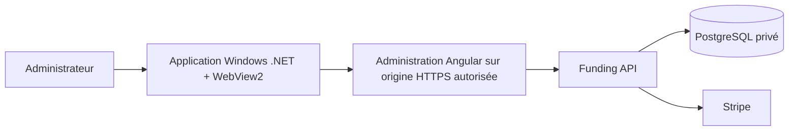

# Plan de travail — OpenG7 Admin pour Windows

Date : 4 octobre 2026. Statut : **à réaliser ultérieurement**.

Ce plan prépare une application Windows pour gérer les contributions et les
commandites. Aucun composant Windows n'est livré par ce document. Les lots
ci-dessous restent à réaliser; leur préparation n'autorise aucune opération de
production, publication, migration ou intervention financière réelle.

## 1. Objectif et première version

Offrir une application « OpenG7 Admin » accessible depuis le menu Démarrer,
avec une fenêtre dédiée et les parcours d'administration du projet.

La première version doit permettre de :

- se connecter avec l'authentification administrative existante;
- consulter, rechercher et filtrer les contributions;
- ouvrir un dossier de commandite, ses informations et son historique;
- effectuer les actions de gestion retenues au cadrage, dont la revue, avec
  les droits, confirmations et validations existants;
- retrouver le contexte après navigation et afficher clairement les erreurs
  de connexion, de session ou de traitement.

Les fonctions Windows envisagées sont une icône près de l'horloge, des
raccourcis clavier et l'ouverture contrôlée des documents. Les notifications
et le lancement à l'ouverture de session seront optionnels.

La gestion technique de PostgreSQL, les sauvegardes, les restaurations, les
déploiements et les traitements financiers automatiques sont des chantiers
distincts. La première version fonctionne avec une connexion au serveur;
aucune mutation hors ligne ni synchronisation financière locale n'est prévue.

## 2. Point de départ inspecté

Ces constats proviennent de la lecture du dépôt, sans recette Windows exécutée.
Vérifier de nouveau les contrats au démarrage du travail.

| Surface             | Existant à réutiliser                                                                                                                                         |
| ------------------- | ------------------------------------------------------------------------------------------------------------------------------------------------------------- |
| Interface           | Administration Angular, entrée `/admin/login` et pages sous `/admin/fundraiser`; [routes admin](../apps/funding-web/src/app/admin.routes.ts).                 |
| Contributions       | Lecture via `GET /api/admin/contributions`; recherche et filtres dans l'interface Angular; [contrôleur](../apps/funding-api/src/admin-contributions.http.ts). |
| Commandites         | Liste, détails et interventions; [contrôleur des dossiers](../apps/funding-api/src/admin-sponsorship-records.http.ts).                                        |
| Revue et visibilité | Décisions distinctes, droits et validations côté API; [contrôleur des décisions](../apps/funding-api/src/admin-sponsorship-decisions.http.ts).                |
| Identité            | Modes OIDC et token, avec des garanties différentes; [runbook identité](operations/admin-identity-and-alerts.md).                                             |
| Reprise             | Pilotage avec version, confirmation et reçus persistants; [contrat de pilotage](operations/admin-pilotage.md#autorité-droits-et-reçus).                       |

## 3. Architecture proposée

Proposition initiale : un hôte C#/.NET avec WebView2 charge l'administration
existante. Le Web continue d'appeler l'API sur l'origine prévue. Cela permet
de réutiliser les écrans et les règles métier tout en ajoutant les fonctions
Windows nécessaires. La version de .NET et la bibliothèque de fenêtre seront
choisies au cadrage parmi les versions maintenues.

L'application n'embarque ni `DATABASE_URL`, ni clé Stripe secrète, ni secret
racine administratif préconfiguré. PostgreSQL demeure privé. L'API conserve
l'autorité sur les droits, les paiements, les décisions et l'audit.

Un service Windows n'est pas nécessaire pour cette première version. Une
surveillance autonome future devra être cadrée séparément, avec une identité
limitée, révocable et expirante. L'authentification administrative actuelle
ne constitue pas un contrat de compte machine à réutiliser implicitement.

## 4. Lots de réalisation

Tous les lots ont le statut **à faire**. Réaliser les lots 1 à 4 avant les
fonctions Windows supplémentaires et la préparation de distribution.

### Lot 1 — Cadrage et preuve de connexion

- [ ] Fixer les versions Windows prises en charge, l'architecture matérielle,
      le framework de fenêtre et la version maintenue de .NET/WebView2.
- [ ] Définir les écrans et actions de la première version, avec leurs rôles API.
- [ ] Tester WebView2 sur une cible locale ou de test dédiée : navigation,
      connexion OIDC, MFA, retour du fournisseur et cookie de session.
- [ ] Vérifier expiration, déconnexion et révocation. Ne pas supposer qu'une
      session navigateur se renouvelle automatiquement.
- [ ] Si le fournisseur refuse le navigateur intégré, définir un parcours
      approuvé via le navigateur système et son retour sécurisé avant de
      poursuivre. Ne pas contourner ses restrictions ni revenir implicitement
      au mode token.
- [ ] Consigner le choix et ses conséquences dans un ADR; actualiser les deux
      versions de l'architecture lorsque la décision est arrêtée.

**Livrable :** décision technique, périmètre fonctionnel et preuve datée de
connexion. **Acceptation :** un administrateur autorisé peut se connecter;
les sessions absentes, expirées ou révoquées sont refusées. Un échec OIDC
empêche d'ouvrir les parcours de gestion.

### Lot 2 — Socle de l'application Windows

- [ ] Créer le projet, emplacement proposé `apps/funding-windows`, sans casser
      la découverte des workspaces Yarn ni les builds TypeScript existants.
- [ ] Ajouter fenêtre, icône, chargement, actualisation et écran d'indisponibilité.
- [ ] Définir une configuration publique minimale : environnement et origine
      HTTPS autorisée, validés au démarrage; aucun secret dans les exemples.
- [ ] Encadrer navigations, fenêtres secondaires et liens externes. L'origine
      métier et les redirections OIDC explicitement permises sont distinctes;
      les liens ordinaires externes ouvrent le navigateur système.
- [ ] Conserver la validation TLS. Éviter les ponts JavaScript/natifs; si un
      besoin justifie un pont, limiter origine, messages et opérations autorisés.

**Livrable :** application lançable sur Windows, connectée à une cible de test.
**Acceptation :** une configuration invalide, un certificat invalide ou une
navigation non autorisée ne donne pas accès à une fonction native privilégiée.

### Lot 3 — Sessions et confidentialité

- [ ] Réutiliser le flux administratif qualifié au lot 1 et les contrôles API.
- [ ] Isoler le profil WebView2 par utilisateur Windows et environnement;
      protéger son répertoire avec les droits du compte utilisateur.
- [ ] Définir la conservation et l'effacement des données de session, puis
      vérifier le comportement après déconnexion, redémarrage et changement
      d'environnement. Fermer les vues privées lorsque la session est refusée.
- [ ] Ne pas créer de cache applicatif de dossiers privés. Limiter les logs à
      des diagnostics sans cookies, tokens, corps privés ni coordonnées inutiles.
- [ ] Tester les rôles lecteur, opérateur et propriétaire côté API, y compris
      un appel direct refusé malgré la présence d'un écran ou d'un bouton.

**Livrable :** cycle de session documenté et vérifié. **Acceptation :** absence
de fuite entre utilisateurs ou environnements; droits appliqués par l'API.

### Lot 4 — Contributions et dossiers de commandite

- [ ] Qualifier les écrans existants dans WebView2 : recherche, filtres,
      pagination, sélection et retour au dossier.
- [ ] Vérifier détails, historique, médias et documents associés aux dossiers.
- [ ] Qualifier chaque action retenue avec rôle, confirmation, réponse serveur
      et actualisation des données. Préserver la séparation entre paiement,
      consentement, revue, visibilité et publication.
- [ ] Couvrir chargement, liste vide, données partielles, accès refusé,
      conflit de version, perte réseau et indisponibilité de l'API.
- [ ] Vérifier double clic et coupure après soumission. Utiliser les mécanismes
      de reprise du contrat concerné; pour le pilotage, consulter le reçu avant
      toute relance. Résoudre les écarts d'idempotence avant de qualifier l'action.

**Livrable :** parcours de gestion utilisables sur une pile de test.
**Acceptation :** aucune réussite financière ou de publication déduite du
seul état de l'interface; aucune répétition automatique d'une mutation incertaine.

### Lot 5 — Intégration au bureau Windows

- [ ] Ajouter menu Démarrer, icône près de l'horloge et comportement explicite
      de fermeture ou de réduction; ne pas conserver une activité invisible
      sans préférence utilisateur.
- [ ] Qualifier clavier, focus, lecteur d'écran, zoom/DPI et plusieurs écrans.
- [ ] Préserver les parcours français et anglais de l'administration; traduire
      les nouveaux textes de l'hôte.
- [ ] Encadrer téléchargements et ouverture de documents : destination choisie,
      format attendu et absence d'exécution automatique de contenu reçu.
- [ ] Évaluer séparément notifications et démarrage à la connexion Windows.
      Notifications désactivables, texte minimal et aucun dossier privé exposé
      sur l'écran verrouillé. Tout rafraîchissement reste borné et en lecture seule.

**Livrable :** application intégrée au bureau. **Acceptation :** fonctionnement
accessible et préférences respectées, sans augmentation des droits administratifs.

### Lot 6 — Recette, packaging et remise

- [ ] Ajouter les commandes de compilation et les contrôles Windows adaptés;
      conserver la CI existante et documenter les prérequis .NET/WebView2.
- [ ] Exécuter la recette ci-dessous avec données synthétiques, API/DB jetables
      et fournisseurs simulés ou de test dans le périmètre autorisé.
- [ ] Choisir le format d'installation, prévoir la signature et documenter
      installation, mise à jour, retour à une version compatible et désinstallation.
      Privilégier l'installation par utilisateur lorsque possible.
- [ ] Tester le paquet sur une machine Windows propre, y compris l'absence
      initiale du runtime WebView2 et le nettoyage du profil à la désinstallation.
- [ ] Documenter versions, résultats, limites et procédure de diagnostic.
      Préparer un artefact local; sa publication ou sa distribution reste distincte.

**Livrable :** paquet local testé et guide d'utilisation.
**Acceptation :** installation reproductible, connexion et parcours qualifiés;
aucune prétention de disponibilité publique avant distribution autorisée.

## 5. Recette minimale à exécuter plus tard

| Domaine            | Scénarios à vérifier                                                                                                        |
| ------------------ | --------------------------------------------------------------------------------------------------------------------------- |
| Connexion          | OIDC/MFA valide ou refusé, expiration, révocation, déconnexion, redémarrage et isolation des profils.                       |
| Droits             | Lecture autorisée, mutation interdite au lecteur, restrictions opérateur/propriétaire et refus API directs.                 |
| Gestion            | Recherche, pagination, dossiers, confirmations, conflit de version, double soumission et audit corrélé.                     |
| Reprise            | API arrêtée, réseau interrompu avant/après soumission, reçu incertain, reconnexion sans rejeu automatique.                  |
| Sécurité de l'hôte | Origine/configuration refusées, certificat invalide, navigation externe, messages natifs et téléchargement non admissibles. |
| Windows            | Installation propre, runtime absent, mise à jour/désinstallation, DPI, clavier, focus, lecteur d'écran et FR/EN.            |

Choisir les suites existantes selon la [matrice de validation](development/validation.md).
Les builds et recettes .NET restent à ajouter : aucune commande Windows nouvelle
n'est présentée ici comme disponible. Les tests applicatifs ne sont pas requis
pour la seule création de ce plan documentaire.

## 6. Reprise du travail et références

Au démarrage, vérifier `git status --short`, relire les instructions des chemins
concernés et confirmer que les contrats inspectés sont toujours valides. Commencer
par le lot 1. Les notifications et un service autonome restent des extensions;
aucune durée ferme n'est estimée avant la preuve de connexion.

- [Frontières et architecture](ARCHITECTURE.md), [consignes Web](../apps/funding-web/AGENTS.md) et [API](../apps/funding-api/AGENTS.md).
- [Contrats API admin](technical/admin-api.md), [identité et sessions](operations/admin-identity-and-alerts.md) et [pilotage](operations/admin-pilotage.md).
- [Règles financières](development/financial-rules.md) et [commandites](development/sponsorship-rules.md).
- [WebView2 — documentation Microsoft](https://learn.microsoft.com/en-us/microsoft-edge/webview2/).
- [Services Windows et interface utilisateur](https://learn.microsoft.com/en-us/windows/win32/services/interactive-services).
